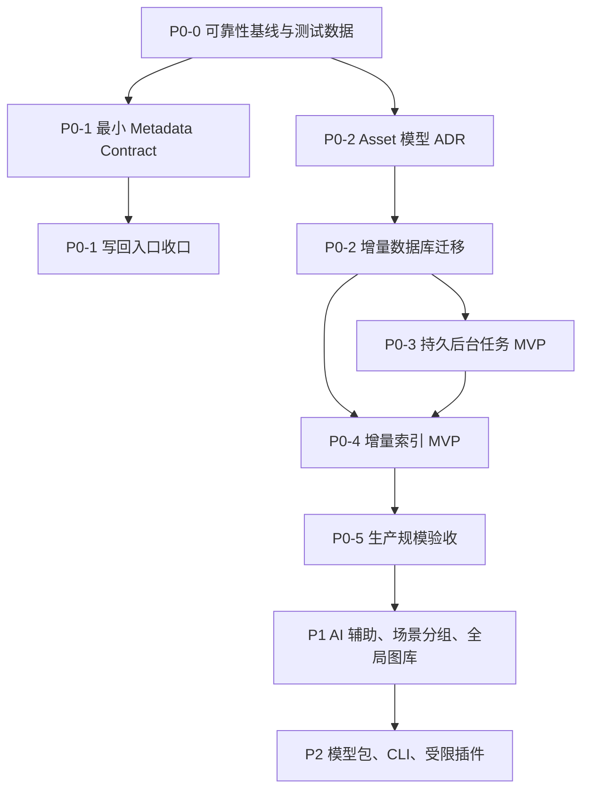

# Gather 核心可靠性、全局资产与后续能力执行计划

> 状态：P0/P1 代码已实现；Asset Cutover 按稳定版本门禁暂不执行；P2 按产品决策暂缓
> 文档版本：v1.5（实现验收版）
> 日期：2026-07-30
> 代码基线：`main` @ `1e214a8`
> 适用范围：本地编译、本地使用；暂不包含安装包、签名和分发
> 原则：先闭合并保护 Capture One 工作流，再扩展全局资产库和 AI 能力

---

## 1. 文档目的

本文将“统一 Photo Asset、统一写回、后台任务、增量索引、AI 挑片、
全局图库、插件和 CLI”等建议转换为可以逐步实施、逐步验收的工程计划。

本文重点回答：

- 当前实现中哪些能力可以直接复用；
- 哪些任务存在前置依赖，不能并行或颠倒顺序；
- 数据库核心模型如何渐进迁移，而不是一次性替换；
- 每个阶段具体修改什么、测试什么、达到什么条件才能进入下一阶段；
- 哪些能力属于当前核心可靠性，哪些应延期到 P1 或 P2；
- 如何确保 Gather 写出的 XMP 能继续由 Capture One 等软件读取。

本文不是要求一次性完成全部路线图。每个阶段都必须保持软件可启动、
旧数据库可读取、现有 Session 工作流可继续使用。

---

## 2. 执行结论

原计划的产品方向成立，但必须调整执行顺序。

推荐顺序：



关键调整：

1. 把真实数据集、回归测试和性能基线提前为 P0-0；
2. 把最小 Metadata Contract 从 P2 提前到所有写回收口之前；
3. 复用现有 `metadata_outbox`，不建立第二套 XMP 队列；
4. 把 Asset 重构拆为设计、扩展、回填、双路径、切换五步；
5. 第一版后台任务不承诺所有任务都能暂停和断点续跑；
6. 文件监听只作为增量扫描提示，不作为磁盘状态的唯一事实来源；
7. P1 不重复实现已有的 Keep K、对比、撤销、顺序/全局相似分组。

### 2.1 已确认的产品决策

以下决策于 2026-07-30 确认，后续实现和 Review 均以此为准。

#### 决策 D-01：Asset 表示一次逻辑拍摄

- 一个 Asset 表示一次拍摄或一张逻辑照片；
- RAW、机内 JPEG、TIFF、代理图和导出文件是 Asset 的不同文件成员；
- checksum 相同只表示内容重复证据，不自动表示同一个 Asset；
- 同一内容位于不同路径时默认保留为独立物理文件，并进入重复候选；
- Asset 使用应用生成的稳定 UUID，不依赖路径、文件名或 checksum。

#### 决策 D-02：RAW+JPEG 默认折叠显示

- 画廊默认每个 Asset 显示一张卡片；
- 卡片显示 `RAW+JPEG` 等变体徽章；
- 默认使用 RAW 内嵌 JPEG 作为浏览预览；
- 详情中允许切换具体变体；
- 提供“展开所有变体”的视图选项；
- Pick/Reject/Pending 作用于逻辑 Asset；
- Rating、Label、Keywords 按实际 Sidecar binding 共享；
- 导出时允许选择 RAW、JPEG 或当前首选文件。

#### 决策 D-03：全局状态与 Session 状态分离

全局或可跨 Session 复用：

- Rating、Color Label、Keywords，以 Sidecar binding 为真实共享边界；
- 文件技术元数据、checksum、缩略图和预览缓存；
- 相似 hash、人脸检测等由输入 fingerprint 和算法签名确定的分析结果；
- Person 人物身份。

保持 Session 独立：

- Pick、Reject、Pending；
- Undo/Redo 历史；
- 当前相似组、Burst、Scene 和导航工作集；
- Keep K 的操作结果；
- 当前筛选、排序和界面状态；
- 依赖当前工作集合产生的人脸聚类或相似分组结果。

同一个 Asset 若解析到不同 Sidecar，不强制共享 Rating、Label 或 Keywords；
真正的交换元数据共享边界是 Sidecar binding，不是 Asset 本身。

#### 决策 D-04：RAW/JPEG 使用保守、可撤销的自动关联

仅在以下条件全部满足时自动归入同一个 Asset：

- 文件位于同一规范化目录；
- basename 完全相同；
- 文件组合是受支持的 RAW + JPEG；
- 拍摄时间均存在且相差不超过 2 秒；
- 相机序列号、图像编号等字段存在时互相兼容。

以下情况只生成候选，不自动合并：

- 文件位于不同目录；
- 只有 basename 相同；
- 拍摄时间缺失；
- 相机信息缺失或冲突；
- TIFF、PSD、导出 JPEG 等无法确认来源。

用户手工合并或拆分优先级最高。用户拒绝的关联永久保存为 `rejected`，后续扫描
不得重复建议。Sidecar 解析与 Asset 关联相互独立：只要多个文件解析到同一 XMP
路径，就必须共享路径级写入队列，即使它们的 Asset 关系仍处于候选状态。

---

## 3. 当前代码基线

### 3.1 已有能力

当前代码已经具备：

- Session 级照片导入和浏览；
- RAW 内嵌 JPEG 优先预览、缓存、预加载和画廊虚拟化；
- Pick、Reject、Pending、0～5 星和 Capture One 颜色标签；
- 单图、双图、四图比较，同步缩放和人脸区域对齐；
- Keep K、组内批量决策和内存级 Undo/Redo；
- 顺序相似分组和全局相似分组；
- 人脸检测、聚类、人物绑定和关键词建议；
- 基于 XMP 路径去重的 `metadata_outbox`；
- XMP baseline、revision、backup、冲突、失败重试和启动恢复；
- ExifTool 验证的 rating、label、keywords 写回；
- Electron production E2E 和核心服务 Vitest。

### 3.2 当前兼容边界

当前核心身份仍是：

```text
session
  └── photo
        ├── metadata cache
        ├── culling decision
        ├── similarity result
        └── face analysis
```

P0/P1 实现后，旧 `photos` 记录仍作为兼容桥保留，但不再承担全局身份：

- `assets`、`asset_files`、`asset_members`、`session_assets` 和 sidecar binding
  已成为跨 Session 身份与共享边界；
- 同一物理文件的多个旧 Photo 记录解析到同一 Asset/File，可复用文件级分析；
- Session 删除只删除 Session membership，Asset 和未完成 Outbox 保留；
- 后台任务、增量索引、全局图库、智能相册和持久挑片历史均已落地；
- 通用 Rating、Label、Keywords 写入已收口到 Metadata Mutation/Outbox；
- 旧表和 dual-read bridge 按渐进迁移约束继续保留，需经过一个稳定版本后才能
  执行不可逆 Contract 清理。

这一兼容桥是阶段 E 的安全门槛，不是第二套长期业务模型。默认画廊和全局查询
已经按逻辑 Asset 折叠，用户仍可展开具体 RAW/JPEG 变体。

### 3.3 明确不重做的内容

以下能力只允许修补缺口，不重新实现：

- Culling 主工作台；
- RAW/JPEG 浏览和预览缓存；
- 顺序/全局相似分组；
- Keep K 和组内批量决策；
- XMP parser/writer；
- Metadata Outbox 的基本状态机；
- 现有 Electron E2E 启动方式。

---

## 4. 产品和工程边界

### 4.1 当前 P0 的核心闭环

```text
导入目录
  → 显示 RAW/JPEG
  → 人工挑片与评分
  → 相似组/人脸辅助
  → 合并写入标准 XMP
  → Capture One Load Metadata
  → 重启后状态仍然一致
```

任何 P0 修改都不得破坏该闭环。

### 4.2 P0 非目标

当前 P0 不包含：

- 云同步和多人协作；
- 自动删除照片；
- 替代 Capture One 的 RAW 调色；
- 任意第三方插件直接访问数据库；
- 对外开放无认证 HTTP 服务；
- AI 自动覆盖人工 Pick、Reject、Rating 或 Label；
- 一次性迁移并删除旧 `photos` 模型；
- 将 Gather 内部 `pickState` 写成未经确认的 XMP 字段；
- 未确认兼容契约前写入 XMP 人脸区域。

### 4.3 数据所有权

| 数据 | 权威来源 | 是否写入 XMP |
|---|---|---|
| 文件路径和在线状态 | 文件索引 | 否 |
| Pick/Reject/Pending | Gather 数据库 | 默认否 |
| Rating | Gather 数据库，XMP 为交换介质 | 是 |
| Color Label | Gather 数据库，XMP 为交换介质 | 是 |
| Keywords | Gather 数据库，XMP 为交换介质 | 是 |
| 人脸框和 embedding | Gather 派生数据 | P0 否 |
| 相似组和质量分 | Gather 派生数据 | 否 |
| Capture One 未知字段 | 外部 XMP | 保留，不覆盖 |

---

## 5. 目标数据模型

### 5.1 模型原则

必须区分：

1. 逻辑照片；
2. 磁盘上的物理文件；
3. RAW/JPEG/TIFF 等关联成员；
4. Session 对照片的引用；
5. XMP sidecar 的共享关系。

不能使用单一 `asset_id` 同时承担以上五种含义。

### 5.2 建议实体

#### `assets`

表示一张逻辑照片或一次拍摄，是跨 Session 复用分析结果的稳定主体。

建议字段：

```sql
CREATE TABLE assets (
  id TEXT PRIMARY KEY,
  capture_fingerprint TEXT NOT NULL DEFAULT '',
  status TEXT NOT NULL DEFAULT 'active',
  created_at TEXT NOT NULL,
  updated_at TEXT NOT NULL
);
```

说明：

- `id` 使用应用生成的 UUID，不依赖文件路径；
- `capture_fingerprint` 只用于候选匹配，不能直接作为全局唯一键；
- Asset 不因 Session 删除而删除；
- 当最后一个引用被移除时进入 orphan 状态，后续由显式清理流程处理。

#### `asset_files`

表示实际存在过的文件和其可定位信息。

```sql
CREATE TABLE asset_files (
  id TEXT PRIMARY KEY,
  volume_id TEXT NOT NULL DEFAULT '',
  normalized_path TEXT NOT NULL,
  filename TEXT NOT NULL,
  extension TEXT NOT NULL DEFAULT '',
  media_type TEXT NOT NULL DEFAULT 'unknown',
  file_size INTEGER NOT NULL DEFAULT 0,
  file_mtime_ms REAL NOT NULL DEFAULT 0,
  checksum TEXT NOT NULL DEFAULT '',
  online_status TEXT NOT NULL DEFAULT 'online',
  last_seen_at TEXT NOT NULL DEFAULT '',
  created_at TEXT NOT NULL,
  updated_at TEXT NOT NULL
);
```

索引原则：

- `(volume_id, normalized_path)` 可以唯一；
- `checksum` 必须建普通索引，不能建全局唯一索引；
- 内容相同的两个独立文件可能是用户有意保留的副本；
- 路径变化不能自动改变 Asset 身份，必须经过重定位匹配。

`asset_files` 不直接保存 `asset_id`。文件与逻辑照片之间的归属只由
`asset_members` 表达，避免两处外键产生不一致。

#### `asset_members`

描述 RAW、JPEG、TIFF、代理图或导出图之间的关系。

```sql
CREATE TABLE asset_members (
  asset_id TEXT NOT NULL REFERENCES assets(id),
  file_id TEXT NOT NULL REFERENCES asset_files(id),
  member_role TEXT NOT NULL,
  is_primary INTEGER NOT NULL DEFAULT 0,
  confidence REAL NOT NULL DEFAULT 1.0,
  binding_source TEXT NOT NULL DEFAULT 'import',
  PRIMARY KEY (asset_id, file_id),
  UNIQUE (file_id)
);
```

一个物理文件在稳定状态下只属于一个 Asset。合并或拆分 Asset 必须在单个事务中
更新 `asset_members`；迁移中的候选关系另存 candidate 表，不能靠重复 membership
表达。每个 Asset 最多一个 `is_primary = 1`，通过部分唯一索引约束。

允许的 `member_role` 初始限定为：

- `raw`;
- `camera_jpeg`;
- `rendered_tiff`;
- `proxy`;
- `export`;
- `unknown`.

同目录、同 basename、接近的拍摄时间只能生成关联候选，不能在所有情况下
静默合并。用户手工拆分或合并后的关系优先级最高。

不确定关系保存在独立候选表：

```sql
CREATE TABLE asset_link_candidates (
  id TEXT PRIMARY KEY,
  left_file_id TEXT NOT NULL REFERENCES asset_files(id),
  right_file_id TEXT NOT NULL REFERENCES asset_files(id),
  relation_type TEXT NOT NULL,
  confidence REAL NOT NULL,
  evidence_json TEXT NOT NULL DEFAULT '{}',
  status TEXT NOT NULL DEFAULT 'pending',
  created_at TEXT NOT NULL,
  updated_at TEXT NOT NULL
);
```

`status` 初始支持 `pending/accepted/rejected`。`rejected` 关系必须保留，防止下一次
扫描再次自动建议用户已经拆分的文件。

#### `session_assets`

表示 Session 与 Asset 的多对多引用。

```sql
CREATE TABLE session_assets (
  session_id TEXT NOT NULL REFERENCES sessions(id) ON DELETE CASCADE,
  asset_id TEXT NOT NULL REFERENCES assets(id),
  display_file_id TEXT REFERENCES asset_files(id),
  import_order INTEGER NOT NULL DEFAULT 0,
  added_at TEXT NOT NULL,
  PRIMARY KEY (session_id, asset_id)
);
```

Session 删除时只删除 `session_assets` 和 Session 独有状态，不删除 Asset、
物理文件记录或可跨 Session 复用的分析结果。

#### `sidecar_bindings`

表示一个 XMP 路径服务于哪些文件或 Asset。

```sql
CREATE TABLE sidecar_bindings (
  id TEXT PRIMARY KEY,
  xmp_path TEXT NOT NULL,
  normalized_xmp_path TEXT NOT NULL UNIQUE,
  binding_rule TEXT NOT NULL,
  status TEXT NOT NULL DEFAULT 'active',
  created_at TEXT NOT NULL,
  updated_at TEXT NOT NULL
);

CREATE TABLE sidecar_binding_files (
  sidecar_binding_id TEXT NOT NULL REFERENCES sidecar_bindings(id),
  file_id TEXT NOT NULL REFERENCES asset_files(id),
  PRIMARY KEY (sidecar_binding_id, file_id)
);
```

`binding_rule` 至少区分：

- `same_basename`;
- `explicit`;
- `adapter_resolved`.

当前 Metadata Outbox 仍以规范化 `xmp_path` 为唯一写盘锁。后续可以增加
`sidecar_binding_id`，但不能改成按 photoId 并发写入。

一个 sidecar 可以绑定多个文件；不能在 `sidecar_bindings` 上只保存单个
`asset_id`。这同时覆盖一个逻辑 Asset 的 RAW/JPEG，以及适配器确认的其他共享
关系。

### 5.3 身份判定规则

导入按以下顺序处理：

1. 使用规范化 volume + path 查找已知文件；
2. 若路径不存在，使用可靠文件 identity 查找移动记录；
3. 使用 size + mtime 判断是否需要重新 fingerprint；
4. checksum 只用于确认内容相同或辅助重定位；
5. RAW/JPEG 使用 basename、目录、拍摄时间、相机信息生成关联候选；
6. 不确定关联保持为两个 Asset，并允许用户后续合并；
7. 用户手工关系永远覆盖自动推断。

不得仅凭以下任一条件直接合并 Asset：

- checksum 相同；
- 文件名相同；
- basename 相同；
- 拍摄时间相同；
- 感知哈希相同。

### 5.4 业务状态的目标归属

Asset 迁移不能只增加主表，还必须明确现有业务表最终引用哪一层：

| 现有状态 | 目标归属 | 迁移说明 |
|---|---|---|
| `photos` | 兼容桥接记录 | 同时保存 nullable `asset_id`、`asset_file_id` |
| `culling_decisions` | Session + Asset | Pick 属于 Session；最终唯一键为 `(session_id, asset_id)` |
| `photo_metadata_cache` 技术字段 | Asset File | 相机、镜头、尺寸、EXIF 和文件 stat 属于具体文件 |
| `photo_metadata_cache` 可编辑字段 | Sidecar binding | Rating、Label、Keywords 由共享 XMP 决定 |
| `similarity_hashes` | Asset File | 对具体像素输入计算，可跨 Session 复用 |
| `similarity_results` | Session 或显式集合 | 分组是工作上下文，不直接全局共享 |
| `face_observations` | Asset File + analysis signature | 检测结果可复用 |
| `face_clusters` | Session/任务结果 | 聚类边界由当前工作集合决定 |
| `persons` | 全局 | 人物身份不随 Session 删除 |
| `person_photos` | Person + Asset + observation | 保留来源 Session 仅用于追溯 |
| `duplicate_groups` | 扫描范围 + Asset File | 分组结果不定义 Asset 身份 |
| `metadata_outbox` | Sidecar binding | 生命周期不能依赖某个 Session |

迁移桥接期的 `photos` 必须同时指向逻辑 Asset 和实际显示文件：

```sql
ALTER TABLE photos ADD COLUMN asset_id TEXT REFERENCES assets(id);
ALTER TABLE photos ADD COLUMN asset_file_id TEXT REFERENCES asset_files(id);
```

只增加 `asset_id` 无法区分同一逻辑照片的 RAW 与 JPEG，也无法正确选择预览、
文件 stat 和导出源。

当前 `photo_metadata_cache` 需要渐进拆分：

```text
asset_file_metadata
  └── dateTaken/camera/lens/exposure/dimensions/file stat

sidecar_metadata_state
  └── rating/label/keywords/baseline/fingerprint/revision
```

桥接期继续更新旧 cache，等所有读取方切换后再删除重复字段。当前
`culling_decisions.rating/color_label` 同样只作为兼容缓存；长期权威值来自
`sidecar_metadata_state`，而 `culling_decisions` 只负责 Session 级 Pick 状态和
操作 revision。

当前 `metadata_outbox.owner_session_id` 带有 Session 级联删除语义。进入全局
Asset 模型后必须改为：

- `sidecar_binding_id` 作为业务目标；
- `created_by_session_id` 只用于审计，允许为空或使用 `ON DELETE SET NULL`；
- 删除 Session 前不删除共享 sidecar 的 pending/conflict 记录；
- 迁移时先复制并验证 Outbox，再改变删除行为。

---

## 6. 最小 Metadata Contract

### 6.1 P0 支持字段

```ts
type MetadataField = 'rating' | 'label' | 'keywords'

interface MetadataPatch {
  rating?: { op: 'set'; value: number }
  label?: { op: 'set'; value: CaptureOneColorLabel }
  keywords?: {
    op: 'append' | 'replace' | 'remove'
    values: string[]
  }
}

interface MetadataMutationRequest {
  target:
    | { photoId: string }
    | { assetId: string; preferredFileId?: string }
  patch: MetadataPatch
  source: 'culling' | 'face-keyword' | 'similarity' | 'template' | 'manual'
  sourceRevision?: number
  requestedAt: string
}

interface ResolvedMetadataMutation extends MetadataMutationRequest {
  resolvedTarget: {
    sidecarBindingId?: string
    xmpPath: string
  }
  dirtyFields: MetadataField[]
}
```

P0-1 尚未建立 Asset 表时，`sidecarBindingId` 为空，`xmpPath` 仍是内部稳定键；
P0-2 完成 sidecar backfill 后再要求该 ID 存在。这避免 Metadata Contract 反向
依赖尚未落地的 Asset schema。

约束：

- Rating 仅允许整数 0～5；
- Label 使用 Capture One 能识别的英文值；
- Keywords 去除空值、首尾空格和重复项；
- 模块只能提交字段 Patch，不能提交完整 XMP；
- 调用方不能提交任意 `xmpPath`，路径由主进程解析；
- `dirtyFields` 由主进程从 Patch 推导，不能信任调用方；
- `pickState` 继续保存在 Gather 数据库；
- `faceRegions` 不进入 P0 Contract；
- 未知 XMP namespace 和非 dirty 字段必须原样保留。

### 6.2 合并语义

每个 dirty 字段保存：

- baseline：Gather 上次读取到的外部值；
- local：用户当前希望写入的值；
- remote：写盘前重新读取的 XMP 值。

三方合并规则：

| 情况 | 处理 |
|---|---|
| remote 等于 baseline | 安全写入 local |
| local 等于 baseline | 接受 remote，无需写入 |
| local 等于 remote | 标记已收敛 |
| 三者不同 | 标记字段级 conflict |
| remote 修改无关字段 | 保留 remote，无需冲突 |

Keywords 的自动合并必须使用明确策略：

- 人脸/相似度建议默认做集合追加；
- 用户在元数据编辑器中的显式替换可以删除关键词；
- 删除操作需要记录 tombstone 或显式 replace 语义；
- 不得把任意两个关键词数组简单取并集。

### 6.3 Outbox 状态机

保留现有状态，并统一入口：

```text
clean
  → pending
  → writing
  → written
  → synced
  → cleaned

writing → failed → pending
writing → conflict
```

规则：

- 同一规范化 XMP 路径只能有一个活跃记录；
- 新 Mutation 合并到未完成记录并递增 revision；
- 写入成功只更新 `persisted_revision`；
- 写盘期间产生的新 revision 必须再次处理；
- 崩溃后 `writing` 恢复为可重试状态；
- 未确认 Capture One 已 Load Metadata 前，不清理 sidecar；
- backup 只通过统一协调器创建和恢复。

---

## 7. P0-0：可靠性基线和测试基础

### 7.1 目标

在修改数据库核心模型之前，固定当前可用行为，并建立能够复现迁移、
写回和大数据性能问题的自动化基础。

### 7.2 工作项

#### P0-0.1 固定核心流程契约

- 列出导入、浏览、挑片、相似度、人脸、写回的公共 IPC；
- 记录每个 IPC 的请求、响应、错误和取消语义；
- 为当前数据库 schema version 14 保存结构快照；
- 保存至少一个脱敏的旧数据库迁移 fixture；
- 禁止在后续阶段无迁移地重命名枚举值或删除字段。

#### P0-0.2 Fixture 工厂

建立运行时生成器，不向 Git 提交数千张真实大图：

- JPEG；
- RAW 测试样本；
- 同 basename RAW+JPEG；
- 独立 XMP 和共享 XMP；
- 含 Capture One、Adobe、IPTC 未知字段的 XMP；
- 外部修改过的 XMP；
- 空文件、截断文件、权限不足文件；
- 路径包含空格、中文、emoji 和大小写差异；
- 500、5000、10000 条数据库/文件索引数据集。

大型数据集默认生成小尺寸合法图片或使用元数据桩。涉及 RAW 解析的测试只保留
少量可合法分发样本，并通过环境变量开启。

#### P0-0.3 核心集成测试

覆盖：

1. 创建 Session 并导入；
2. 等待缩略图和页面可见；
3. 设置 Pick、Rating、Label；
4. 通过人物绑定或模板生成关键词 Patch；
5. 等待 Outbox 写入；
6. 使用 ExifTool 独立读取；
7. 重启应用；
8. 验证数据库、UI 和 XMP 一致；
9. 模拟 `writing` 中断并验证恢复；
10. 模拟外部同字段修改并验证 conflict。

#### P0-0.4 性能基线

在固定参考机器上记录：

- 首次导入 500/5000/10000 张的耗时；
- 第二次打开耗时；
- 首屏可交互时间；
- 缩略图队列吞吐；
- 峰值 RSS；
- SQLite 文件大小；
- 单张 Rating 到 Outbox clean/written 的延迟；
- 关闭窗口时是否存在未终止子进程。

报告必须注明：

- CPU；
- 内存；
- 磁盘类型；
- macOS 版本；
- Node/Electron 版本；
- 是否启用 ONNX 和 GPU provider。

### 7.3 验收门槛

- 当前核心 E2E 在未修改业务前稳定通过三次；
- schema 14 fixture 能重复打开；
- ExifTool 能读取 Rating、Label、Keywords；
- 同 basename RAW/JPEG 只产生一次 sidecar 写入；
- 外部无关字段不被修改；
- 破损文件不会导致主进程崩溃；
- 所有性能指标已有基线值，不要求本阶段优化。

### 7.4 退出条件

未完成数据库 fixture、XMP fixture 和核心 E2E 前，不进入 Asset schema 迁移。

---

## 8. P0-1：Metadata Contract 与写回入口收口

### 8.1 目标

所有对 Rating、Label、Keywords 的修改都进入同一个 Mutation API 和同一个
Metadata Outbox；任何业务模块都不得直接拼接或覆盖完整 XMP。

### 8.2 工作项

#### P0-1.1 共享协议

- 在 `packages/shared` 定义 `MetadataPatch`、`MetadataMutation`；
- 定义 dirty field、source、revision 和 conflict DTO；
- 对 rating、label 和 keyword 做运行时校验；
- IPC handler 不接受调用方传入任意文件写入路径；
- 主进程根据受信 photo/asset 解析 XMP 路径。

#### P0-1.2 收口 Culling

- 保留现有乐观 UI 和 SQLite 原子决策；
- Rating、Label 变更调用统一 Mutation Service；
- Pick/Reject 只更新内部状态；
- 若用户启用 Pick→Label 兼容预设，由映射层生成 Label Patch；
- 连续按键合并到同一 XMP Outbox 记录。

#### P0-1.3 收口人脸、相似度和模板

- 人脸绑定只生成 keyword append Mutation；
- 解绑必须明确是撤销本模块写入的关键词，不能删除用户手工同名关键词；
- 相似度模块只在有明确产品动作时生成关键词；
- 模板应用拆成字段 Patch；
- 删除业务模块中的直接 writer 调用；
- 显式批量 Writeback 复用相同 Mutation/Coordinator 核心。

#### P0-1.4 三方合并和冲突 UI

- 将 conflict 精确到字段；
- 展示 baseline、Gather 值、外部值；
- 支持“保留 Gather”“采用外部”“逐字段选择”；
- 冲突未解决时不自动覆盖；
- 解决冲突产生新 revision 并重新排队。

#### P0-1.5 写回预览

预览必须展示：

- 目标 XMP 路径；
- 修改字段；
- 原值和新值；
- 来源模块；
- 是否共享 sidecar；
- 是否存在外部变化；
- 将创建还是更新 sidecar。

预览不重新实现一套写回计算；必须调用与 execute 相同的规范化和合并逻辑，
只是不落盘。

#### P0-1.6 旧 WritebackService 收缩

- 盘点所有调用点；
- 将通用 XMP 读写迁移到协调器；
- `WritebackService` 若仍保留，只负责业务批次编排和预览；
- 不再拥有独立的 backup、retry、confirm 或 cleanup 状态机；
- 将可解析的 pending/failed `writeback_items` 转换为 keyword Mutation；
- 无法解析目标路径的旧记录保留并显示可操作错误，不能静默丢弃；
- 旧表先保留只读兼容，确认无活跃数据并经过一个稳定版本后再删除。

#### P0-1.7 Outbox 生命周期去 Session 化

Asset 表落地前仍保留 `xmp_path` 主键，但必须先解决 Session 删除误删待写状态：

- 把 `owner_session_id` 迁移为可空的 `created_by_session_id`；
- 审计外键使用 `ON DELETE SET NULL`；
- Session 删除前不要求强制写盘，也不会删除 pending/conflict；
- Outbox 列表按创建 Session 过滤时，仍允许查看“原 Session 已删除”的记录；
- P0-2 再回填 `sidecar_binding_id`，不在 P0-1 引入 Asset 依赖。

### 8.3 测试

- 同一照片快速连续修改 Rating、Label、Keywords；
- 写盘期间继续修改同一字段；
- 两个照片共享同一个 XMP；
- 两个 Session 指向同一 XMP；
- 外部修改无关字段；
- 外部修改同一字段；
- 应用在 `writing` 状态退出；
- backup 创建失败；
- 磁盘只读或空间不足；
- keyword append、replace、remove；
- Capture One 颜色标签 round-trip。

### 8.4 验收门槛

- 全仓库只有统一 writer 可以修改 XMP；
- 同一路径不存在两个并行写入者；
- P0 三个字段全部支持字段级冲突；
- 人工决定在写盘失败后仍保留；
- 重启后 pending/writing/failed 可恢复；
- Capture One Load Metadata 能识别结果；
- 旧 Session 和旧 Outbox 数据可继续处理。

---

## 9. P0-2：Asset 模型设计与渐进迁移

### 9.1 目标

建立跨 Session 稳定身份，同时不破坏当前以 `photos.id` 为外键的业务。

### 9.2 阶段 A：固化 ADR 和不变量

产品决策已在 D-01～D-04 中确认。本阶段不再讨论产品方向，而是将决策转换为
可测试的 ADR、数据库不变量和服务接口：

- Asset 表示一次逻辑拍摄；
- RAW/JPEG 等变体通过 `asset_members` 归属 Asset；
- 画廊默认折叠，允许临时展开变体；
- Pick/Reject 属于 `(session_id, asset_id)`；
- Rating/Label/Keywords 属于 Sidecar binding；
- 技术分析按 file fingerprint + algorithm/model signature 复用；
- Person 全局共享，工作集聚类保持 Session 或 Job 级；
- Session 删除只删除 membership 和 Session 独有状态；
- 物理文件缺失只改变在线状态，不删除 Asset；
- 自动关联严格执行 D-04，并允许持久拒绝、手工拆分和合并。

ADR 必须补充以下工程细节：

- 支持的 RAW 扩展名和 JPEG 类型清单；
- 拍摄时间读取优先级和时区处理；
- basename 大小写和 Unicode 规范化；
- 相机序列号、图像编号字段的兼容判断；
- 默认 preview member 和 export member 的选择规则；
- Asset merge/split 的事务和下游引用迁移；
- orphan Asset 的保留时间及显式清理入口；
- Sidecar binding 重新解析时的冲突处理。

### 9.3 阶段 B：Expand

- 新增 `assets`；
- 新增 `asset_files`；
- 新增 `asset_members`；
- 新增 `asset_link_candidates`；
- 新增 `session_assets`；
- 新增 `sidecar_bindings`；
- 新增 `sidecar_binding_files`；
- 新增 `asset_file_metadata` 和 `sidecar_metadata_state`；
- 给 `photos` 增加 nullable `asset_id` 和 `asset_file_id`；
- 给需要逐步迁移的派生表增加 nullable `asset_id` 或 `asset_file_id`；
- 建立索引和外键，但暂不删除旧字段；
- 更新 schema version；
- 每个迁移步骤必须幂等。

### 9.4 阶段 C：Backfill

按批次回填：

1. 对旧 Photo 解析 volume、规范化路径和文件 stat；
2. 完全相同的物理文件 identity 只生成一个 `asset_files`；
3. 同一个物理文件跨 Session 的旧 Photo 直接引用同一 Asset；
4. 无法访问的旧路径按规范化路径保守分组，并标记为 `offline_unverified`；
5. 建立 `session_assets` 和 Photo bridge；
6. 记录 sidecar binding 及其 file members；
7. RAW/JPEG 只在规则完全确定时合并为同一 Asset；
8. 不确定关联写入 candidate 表，不自动合并；
9. 为每批次保存 migration cursor。

不采用“每个旧 Photo 先生成一个 Asset、之后再全量合并”的方案。该方式会产生
大量临时重复身份，而且合并过程会迫使所有下游外键再次重写。

回填期间记录：

- 总照片数；
- 已迁移数；
- 无法 stat 的文件数；
- 路径冲突数；
- sidecar 冲突数；
- 候选变体数；
- 自动合并数。

### 9.5 阶段 D：Dual Read / Dual Write

- 新导入同时创建 Asset 和旧 Photo；
- 新服务优先读 Asset，缺失时回退旧 Photo；
- 旧业务继续使用 photoId；
- 引入 `PhotoAssetResolver` 统一 photoId、assetId、fileId 转换；
- 禁止 renderer 自行拼接这些关系；
- 增加新旧读取结果一致性断言和诊断日志；
- 使用内部 feature flag 分别控制 dual write、shadow read 和新模型主读；
- flag 只用于阶段切换，不作为长期保留的用户设置。

Shadow read 不改变 UI 返回值，只比较：

- Session 照片数量；
- 排序；
- photoId 到 asset/file 的映射；
- XMP 路径；
- Rating、Label、Keywords；
- Culling 状态。

诊断信息不得记录用户关键词、人脸 embedding 或完整绝对路径；路径只记录不可逆
摘要和错误类别。

### 9.6 阶段 E：Cutover

只有达到以下条件才切换：

- 所有旧 Photo 都有 Asset；
- 所有 Session 中显示数量一致；
- 所有 culling、face、similarity 外键可解析；
- XMP 路径解析结果一致；
- shadow read 的不一致率为 0；
- 删除 Session 不会删除 Asset；
- E2E 和迁移 fixture 全部通过；
- 至少经过一个完整稳定版本。

Cutover 后：

- 新查询使用 Asset 模型；
- 旧字段标记 deprecated；
- 暂不删除旧表；
- 下一个独立版本再执行 Contract 清理。

### 9.7 备份与恢复

迁移前：

- 暂停会写数据库的后台任务并阻止新 writer；
- 执行 `PRAGMA wal_checkpoint(TRUNCATE)`；
- 通过 SQLite backup API 创建一致性快照，不能直接复制活动中的 db 文件；
- 创建带 schema version 和时间戳的数据库备份；
- 验证备份可打开；
- 检查可用磁盘空间；
- 记录迁移开始标记。

迁移失败：

- 不尝试用复杂 down migration 修改原数据库；
- 关闭当前数据库；
- 保留失败副本用于诊断；
- 从迁移前备份恢复；
- 不删除任何用户照片或 XMP。

### 9.8 验收门槛

- 同一磁盘文件加入两个 Session 不重复计算可复用分析；
- 删除一个 Session 不删除 Asset；
- 同 basename RAW/JPEG 可显示关联状态；
- 错误关联可以拆分；
- 外置盘离线后 Asset 仍存在；
- schema 14 数据可以升级；
- 迁移中断后可以恢复或安全重新执行；
- 导入、挑片、XMP 写回行为与迁移前一致。

---

## 10. P0-3：持久后台任务 MVP

### 10.1 目标

让耗时任务在数据库中拥有明确生命周期，可取消、可重试、可诊断；不要求所有
任务在第一版都支持暂停和精确断点续跑。

### 10.2 建议数据模型

```sql
CREATE TABLE analysis_jobs (
  id TEXT PRIMARY KEY,
  type TEXT NOT NULL,
  scope_type TEXT NOT NULL,
  scope_id TEXT NOT NULL,
  dedupe_key TEXT NOT NULL,
  status TEXT NOT NULL,
  priority INTEGER NOT NULL DEFAULT 0,
  progress_current INTEGER NOT NULL DEFAULT 0,
  progress_total INTEGER NOT NULL DEFAULT 0,
  progress_message TEXT NOT NULL DEFAULT '',
  input_fingerprint TEXT NOT NULL DEFAULT '',
  model_id TEXT NOT NULL DEFAULT '',
  model_version TEXT NOT NULL DEFAULT '',
  checkpoint_json TEXT NOT NULL DEFAULT '{}',
  attempt_count INTEGER NOT NULL DEFAULT 0,
  lease_owner TEXT NOT NULL DEFAULT '',
  heartbeat_at TEXT NOT NULL DEFAULT '',
  cancel_requested_at TEXT NOT NULL DEFAULT '',
  error_code TEXT NOT NULL DEFAULT '',
  error_message TEXT NOT NULL DEFAULT '',
  created_at TEXT NOT NULL,
  started_at TEXT NOT NULL DEFAULT '',
  finished_at TEXT NOT NULL DEFAULT '',
  updated_at TEXT NOT NULL
);
```

活跃去重索引不能只依赖普通 `UNIQUE(dedupe_key)`，否则历史成功任务会阻止重跑。
应使用覆盖 `queued/running/cancelling` 的部分唯一索引。若目标 SQLite 版本或
迁移兼容性不允许，则在 `BEGIN IMMEDIATE` 事务中检查并创建。

`lease_owner` 和 `heartbeat_at` 用于区分仍在运行与已经失去执行者的任务。不能
只在应用启动时把所有 `running` 改为 interrupted；运行中的 worker 崩溃也必须
能由 watchdog 检测。

### 10.3 第一版状态

```text
queued
  → running
  → succeeded
  → failed
  → cancelled
  → interrupted

queued/running → cancelling → cancelled
failed/interrupted → queued
```

`paused` 只有在某一种任务真正实现可靠 checkpoint 后才加入，不作为 MVP
统一承诺。

### 10.4 任务恢复策略

| 任务 | 第一版重启策略 | Checkpoint |
|---|---|---|
| metadata.scan | 从最后批次继续 | 目录游标/最后 fileId |
| thumbnail.build | 重新排队未完成项 | 已生成缓存即完成 |
| similarity.analyze | 重新开始聚类，复用 hash | hash 状态 |
| duplicate.scan | 复用 checksum，重建分组 | checksum 状态 |
| face.analyze | 跳过 fingerprint 未变的照片 | photo fingerprint |
| quality.score | 跳过签名匹配的结果 | model/input signature |
| export.execute | 第一版重新开始未完成文件 | 导出项状态 |

`metadata.writeback` 不进入 `analysis_jobs`。它继续由 Metadata Outbox 保证业务
一致性，任务中心可以聚合展示其状态，但不能复制状态。

### 10.5 调度器职责

持久 Job Service 负责：

- 创建、去重和状态事务；
- 启动时恢复；
- lease、heartbeat 和失效任务回收；
- 取消令牌；
- 进度节流写入；
- 错误分类；
- retry policy。

现有 Heavy Task Scheduler 负责：

- CPU 并发上限；
- 交互优先级；
- 避免多个重任务同时压满资源。

两者不合并为一个巨型类。

### 10.6 UI

第一版任务中心显示：

- 类型和作用域；
- 等待/运行/失败/完成状态；
- 当前进度；
- 取消；
- 重试；
- 错误详情；
- 清理已完成历史。

第一版不要求复杂 DAG、时间线或任意优先级编辑。

### 10.7 验收门槛

- 应用退出后 Job 记录不丢失；
- 启动时 running 被转换为 interrupted 并按类型处理；
- 同一 dedupe key 不会同时运行两次；
- 取消后不提交半成品最终结果；
- progress 高频更新不会阻塞 SQLite；
- UI 关闭不会取消主进程任务；
- 无 GPU 时仍能运行非 AI 核心流程。

---

## 11. P0-4：增量索引与文件变化

### 11.1 目标

避免每次打开都重新处理所有照片，并正确表达移动、离线和重新挂载。

### 11.2 MVP 顺序

#### P0-4.1 手动重扫

- 递归枚举受管目录；
- 使用扩展名和 MIME 白名单；
- 批量 stat；
- size + mtime 未变则跳过内容处理；
- 变化候选计算 SHA-256；
- 更新 `last_seen_at`；
- 扫描结束后把未见文件标记 missing，不立即删除。

#### P0-4.2 打开时轻量扫描

- Session 打开后异步启动；
- 首屏浏览不等待完整扫描；
- 优先扫描当前 Session 和可见目录；
- 扫描进度进入任务中心；
- 发现变化后只使相关缓存和分析失效。

#### P0-4.3 离线卷

- 保存稳定 volume identity；
- 卷整体不可用时标记 volume offline；
- 不把其中每张照片解释为用户删除；
- 重新挂载后按 volume + path 快速恢复；
- volume identity 不可靠时允许用户手工重新关联根目录。

#### P0-4.4 移动和重命名

候选匹配顺序：

1. 平台文件 identity；
2. 同卷 checksum + size；
3. 用户选择的新根目录 + 相对路径；
4. 人工确认。

只有确认匹配后才更新 `asset_files.normalized_path`。

#### P0-4.5 文件监听

- watcher 只触发局部扫描；
- 事件必须防抖和合并；
- overflow 或 watcher 错误触发完整目录重扫提示；
- 网络卷不承诺实时事件；
- 应用重启后仍以扫描结果为准。

### 11.3 缓存失效

文件内容变化后分别处理：

- 内嵌预览：按 file fingerprint 失效；
- 缩略图：按 preview signature 失效；
- 相似 hash：按 hash signature 失效；
- 人脸：按模型版本 + 输入 fingerprint 失效；
- 质量评分：按模型版本 + 输入 fingerprint 失效；
- Metadata cache：按文件/XMP fingerprint 失效；
- 人工 Pick/Reject 不失效；
- 人工 Rating/Label/Keywords 进入冲突检查，不静默删除。

### 11.4 验收门槛

- 10000 条未变化索引重新打开时不重新计算 checksum；
- 修改一张照片只使该照片的派生结果失效；
- 移动文件可重新定位；
- 外置盘断开不删除记录；
- watcher 漏事件后手动/打开时扫描可以修正；
- 扫描期间浏览和挑片仍可操作。

---

## 12. P0-5：生产规模和发布门槛

### 12.1 自动化门禁

每个 PR 至少运行：

```bash
npm run typecheck
npm run lint
npm run test:vitest
npm run build
git diff --check
```

影响 Electron 主流程、数据库、IPC、预览或 XMP 的 PR 还必须运行：

```bash
npm run test:e2e
```

涉及 RAW/ONNX 的用例按环境能力运行；缺少模型时可以跳过对应测试，但不能把
普通 JPEG、数据库迁移和 XMP 核心流程一起跳过。

### 12.2 数据规模门槛

必须分别验证：

- 500 张：日常小项目；
- 5000 张：大型拍摄；
- 10000 张：压力场景；
- 100000 条：全局索引数据库规模，不要求一次加载全部真实图片。

每项必须记录：

- 操作耗时；
- 峰值内存；
- UI 主线程最长卡顿；
- 新增数据库大小；
- 重启后重复计算数量；
- 失败和重试数量。

不能只写“性能良好”。性能验收必须使用同一参考机器的基线和回归阈值。

建议第一阶段采用相对门槛：

- 未修改相关功能时不得比基线慢 20% 以上；
- 第二次打开不得重新处理 fingerprint 未变化的全部照片；
- 长任务运行时，导航/挑片输入到 UI 状态更新的 p95 不超过 100ms；
- 取消请求在 1 秒内进入 `cancelling`，任务在下一个安全取消点退出；
- 单个 Job 的进度持久化频率默认不超过每秒 4 次；
- 记录超过 200ms 的 Renderer 或主进程事件循环阻塞；
- 内存不能随处理照片数无限线性增长；
- 所有队列必须有明确并发上限。

以上是首轮暂定门槛。P0-0 取得参考机器数据后允许调整，但调整必须在具体优化
开始前写入基线报告，不能在测试失败后临时放宽。

### 12.3 人工兼容矩阵

每个准备发布的数据库/XMP 变更需要执行：

| 项目 | 验证方式 |
|---|---|
| XMP 语法 | ExifTool Validate |
| Rating | ExifTool 读取 + Capture One Load Metadata |
| Label | 英文颜色标签 round-trip |
| Keywords | 层级和普通关键词读取 |
| 未知 namespace | 写回前后语义比较 |
| RAW/JPEG 共 sidecar | 两个变体读取一致 |
| 外部同字段修改 | UI conflict |
| 外部无关字段修改 | 安全保留 |
| 重启恢复 | pending/writing/failed 恢复 |

自动测试不直接修改用户真实 Capture One Catalog。Capture One 验证使用临时
Catalog 或人工测试项目。

---

## 13. P1：AI 辅助、场景分组和全局工作流

P1 必须在 P0 完成后按独立功能逐项交付，不能合成一个大型 PR。

### 13.1 P1-1 可解释技术质量评分

第一批只做相对客观指标：

- 全图锐度；
- 主体/人脸区域锐度；
- 曝光异常；
- 闭眼风险启发式（当前不是眼部关键点模型输出的概率，UI 和协议不得标为概率）；
- 计算置信度；
- 相似组内相对排名。

延后：

- 通用审美总分；
- 构图好坏；
- 自动决定 Pick/Reject；
- 用户未确认的数据上传。

建议数据：

```text
asset_analysis
  ├── asset_id / asset_file_id
  ├── analysis_type
  ├── result_json
  ├── warnings_json
  ├── model_id
  ├── model_version
  ├── input_fingerprint
  └── created_at
```

每个分数必须能够说明来源、模型版本和失效原因。模型升级产生新结果，不覆盖
人工状态。

验收：

- 无人脸照片不产生虚假的 faceQuality；
- 模型版本变化后可重算；
- 相同 fingerprint 和模型版本不重复计算；
- UI 展示分维度结果；
- AI 推荐与人工决定分离。

### 13.2 P1-2 Burst 和 Scene

复用现有顺序/全局相似算法，增加：

- 拍摄时间间隔；
- 文件名序列；
- 相机序列信息；
- 视觉相似度；
- 用户手工拆分/合并覆盖。

Scene/Burst 是导航结构，不直接写入 XMP。

Lead Photo 依赖质量评分；在质量评分不可用时，只按明确规则排序，不伪装成
AI 最佳图。

已有 Keep K 继续使用。新增任务主要是：

- 按 Burst/Scene 导航；
- 保存用户覆盖；
- dry-run 展示分组变化；
- 增量更新；
- 组内建议来源说明。

### 13.3 P1-3 Culling 补缺

不重做当前工作台，只补：

- 持久操作命令日志；
- 跨重启 Undo/Redo 的产品边界；
- “未分析”“分析失败”“元数据冲突”筛选；
- AI/人工/模板来源标记；
- Burst/Scene 导航；
- 对关联变体共享元数据的显式提示。

持久历史需要记录 before、after、revision 和目标集合。撤销时若当前 revision
已经变化，应提示冲突，不能覆盖后续操作。

### 13.4 P1-4 全局图库

依赖 Asset 和增量索引完成。

第一版提供：

- 全局照片列表；
- Session 筛选；
- 目录和卷筛选；
- 在线/离线状态；
- Rating、Label、Keywords；
- Person；
- 重复候选；
- 最近导入。

第一版不实现完整 DAM 权限、版本管理或云同步。

### 13.5 P1-5 Smart Album

复用现有 repository/filter 基础，补充：

- 过滤条件 runtime schema；
- `schemaVersion`；
- 未知条件兼容和错误提示；
- 正确的分页 total；
- 全局 Asset 查询；
- UI 创建、编辑、删除和预览；
- 组合条件性能索引。

智能相册只保存查询定义，不复制 Asset。

---

## 14. P2：模型、CLI 和受限扩展

P2 在具体产品需求确认前暂缓实现，但保留以下顺序。

### 14.1 模型注册与模型包

先建立：

- model id/version；
- 输入尺寸和预处理；
- checksum；
- license；
- provider 支持；
- 下载/安装/删除；
- 回滚；
- 结果签名。

模型目录不等于插件系统。模型执行仍由受控服务负责。

### 14.2 Headless Application Service 和 CLI

先把主进程业务能力抽成可在无 Renderer 环境调用的 application service，再提供：

```text
gather scan
gather analyze
gather cull-status
gather writeback
gather export
```

CLI 默认输出机器可读结果并使用与 Electron 相同的数据库锁、任务和写回规则。

### 14.3 本地 API

只有确有外部集成需求时才增加。

最低安全要求：

- 只监听 loopback 或 Unix socket；
- 随机 token；
- 默认关闭；
- 不允许调用方传入任意文件系统路径；
- 权限分级；
- 请求审计；
- 速率和并发限制。

### 14.4 插件 API

第一版插件不得：

- 直接访问 SQLite；
- 在 Renderer 注入任意代码；
- 注册任意 XMP namespace 后直接写盘；
- 读取未授权目录；
- 绕过任务和 Metadata Outbox。

建议先支持受限分析插件：

```text
manifest
  ├── id/version
  ├── apiVersion
  ├── capabilities
  ├── model dependencies
  ├── input contract
  └── output schema
```

插件运行在独立 worker/进程，通过 capability allowlist 获取缩略图或标准化输入，
只返回版本化分析结果。

---

## 15. PR 和提交拆分

每一个 PR 必须保持可运行，禁止“先破坏、后续 PR 再修复”。

建议拆分：

| PR | 内容 | 依赖 |
|---|---|---|
| 01 | Fixture 工厂和 schema 14 迁移样本 | 无 |
| 02 | 写回/冲突/重启 E2E | 01 |
| 03 | 最小 Metadata Contract 和 Outbox 生命周期迁移 | 02 |
| 04 | Culling 接入统一 Mutation | 03 |
| 05 | Face/Similarity/Template 接入 | 03 |
| 06 | 冲突 UI 和统一预览 | 04、05 |
| 07 | Asset ADR 和不变量测试 | 01，可与 02～06 并行 |
| 08 | Asset 新表与 nullable bridge | 07 |
| 09 | Backfill 与迁移恢复 | 08 |
| 10 | 新导入 dual write | 09 |
| 11 | Asset dual read 和一致性诊断 | 10 |
| 12 | Persistent Job schema/service | 09 |
| 13 | Job runner 和任务中心 | 12 |
| 14 | 手动/打开时增量扫描 | 11、13 |
| 15 | 离线卷和重新关联 | 14 |
| 16 | Watcher 提示和局部扫描 | 14 |
| 17 | 规模测试和性能治理 | 11～16 |

提交信息遵循 `docs/CONTRIBUTING.md`。数据库变更、共享协议、主进程实现、
Renderer UI 和测试可以放在同一功能 PR，但应按可审阅的独立 commit 组织。

---

## 16. Review 清单

### 16.1 数据库

- migration 是否可重复执行；
- 是否在事务中；
- 是否有迁移前备份；
- 是否验证外键和行数；
- 是否保留旧字段；
- Session 删除是否可能误删 Asset；
- checksum 是否被错误设为唯一；
- 索引是否覆盖真实查询；
- 大表迁移是否分批。

### 16.2 IPC 和安全

- Renderer 是否只能使用白名单 IPC；
- 是否在主进程校验 ID 的所属关系；
- 是否允许不可信路径；
- 错误是否能返回 UI；
- 取消是否真正传到服务；
- 是否出现重复 handler 或重复业务入口。

### 16.3 XMP

- 是否仅修改 dirty fields；
- 是否重新读取外部文件；
- 是否按 XMP 路径串行；
- 是否原子写入；
- 是否保存 backup；
- 是否保留未知 namespace；
- 是否区分 append、replace 和 remove；
- 是否通过 ExifTool；
- 是否通过 Capture One 人工矩阵。

### 16.4 后台任务

- 是否幂等；
- 是否有活跃任务去重；
- 是否有明确取消点；
- 失败是否留下半成品；
- 重启策略是否按任务类型定义；
- progress 是否节流；
- 模型和输入 fingerprint 是否记录。

### 16.5 UI

- 长任务是否阻塞导航；
- 错误是否可操作；
- 是否显示数据来源；
- 冲突是否明确到字段；
- 离线是否与删除区分；
- AI 建议是否与人工状态区分；
- 共享 sidecar 是否有提示。

---

## 17. 风险与应对

| 风险 | 影响 | 应对 |
|---|---|---|
| Asset 自动合并错误 | 两张照片错误共享元数据 | 保守候选、允许拆分、人工覆盖优先 |
| 数据库迁移中断 | 应用无法启动或数据丢失 | 迁移前备份、分批 cursor、幂等迁移 |
| 双路径长期存在 | 逻辑分叉和维护成本 | 设置一致性指标和明确 Cutover 条件 |
| 两个模块写同一 XMP | 字段丢失 | 唯一 Mutation API、路径级串行 |
| 外部软件同时写入 | 覆盖用户修改 | baseline 三方合并和字段级冲突 |
| watcher 漏事件 | 索引过期 | watcher 只作提示，扫描负责校正 |
| Job 过度抽象 | 所有任务被迫使用错误模型 | MVP 只统一生命周期，恢复策略按类型 |
| 10 万规模验收含糊 | 无法判断是否完成 | 固定机器、指标、基线和回归阈值 |
| AI 结果不可解释 | 用户不信任推荐 | 分维度分数、warning、model version |
| 插件破坏数据 | XMP 或数据库损坏 | 隔离进程、capability、禁止直接写盘 |

---

## 18. 阶段完成定义

一个阶段只有同时满足以下条件才算完成：

- 代码、迁移、协议和 UI 闭环已实现；
- 单元测试和至少一条集成/E2E 覆盖关键路径；
- 旧数据库和新数据库均已验证；
- 错误、取消、重启和离线边界已处理；
- 类型检查、Lint、Vitest、Build 通过；
- 涉及主流程时 Electron production E2E 通过；
- 涉及 XMP 时 ExifTool 和 Capture One 矩阵通过；
- 性能没有超过已约定的回归阈值；
- 文档同步更新；
- 无临时双写、兼容开关或 deprecated 字段未登记清理条件。

阶段不能因为“主要 happy path 可用”而跳过迁移恢复、冲突和失败测试。

---

## 19. 总体验收

P0 全部完成后，Gather 应达到：

1. 用户可以继续使用现有 Session 导入、浏览、挑片和 XMP 工作流；
2. 同一物理照片跨 Session 不重复执行可复用分析；
3. Session 删除不会删除全局 Asset；
4. RAW/JPEG/sidecar 关系明确并可纠正；
5. Rating、Label、Keywords 只有一个写回入口；
6. 外部同字段修改产生可处理 conflict；
7. 写盘失败和应用崩溃不会丢失人工决定；
8. 重任务可见、可取消、可重试，重启后状态可恢复；
9. 未变化照片不会在每次打开时重新计算；
10. 外置盘离线不会被误认为照片被删除；
11. 大型 Session 仍能浏览和挑片；
12. 标准 XMP 可以由 ExifTool 和 Capture One 读取。

达到以上条件后，再开始 AI 质量评分、Scene/Burst 和全局图库，能够避免这些
上层功能继续依赖 Session Photo、临时队列和不可恢复任务状态。

---

## 20. 推荐立即启动的任务

第一批只启动以下工作，不并行开始 Asset Cutover、Watcher 和 AI：

1. 建立 schema 14 数据库 fixture；
2. 建立 XMP 冲突和共享 sidecar fixture；
3. 固定导入→挑片→写回→重启 E2E；
4. 编写最小 Metadata Contract；
5. 盘点所有 XMP writer 调用点；
6. 按 D-01～D-04 输出 Asset ADR 和数据库不变量测试；
7. 记录 500/5000/10000 数据规模基线。

完成第一批并通过 Review 后，再批准 P0-1 写回收口和 P0-2 Expand migration
进入实现。

---

## 21. 自审记录

2026-07-30 完成第一轮可执行性自审，并修正：

- 删除 `asset_files.asset_id` 与 `asset_members` 的重复归属；
- 增加唯一 file membership、primary member 和关联候选模型；
- 增加 sidecar 与多个物理文件的成员表；
- 将公开 Metadata Request 与内部解析后的 XMP 路径分离；
- 为 Keywords 明确定义 append、replace、remove；
- 拆分文件级技术元数据与 sidecar 级可编辑状态；
- 明确 `photos` 需要同时桥接 `asset_id` 和 `asset_file_id`；
- 明确 Culling、Face、Similarity、Person、Outbox 的目标归属；
- 修正旧 Photo 回填策略，避免先制造大量重复 Asset 再合并；
- 修正 SQLite WAL 备份流程；
- 增加 Job lease、heartbeat 和失效 worker 回收；
- 增加 Outbox 生命周期去 Session 化的独立任务；
- 增加 shadow read、feature flag、诊断隐私和量化性能门槛。

自审后未发现阻止文档进入执行评审的结构性问题。原待确认的 Asset 语义、
RAW/JPEG 折叠方式、Session 状态共享范围和自动关联规则已按 D-01～D-04
全部确认。P0-2 只需把这些决策固化为 ADR、数据库约束和自动化测试，不再等待
额外产品决策。

### 21.1 实现验收记录

2026-07-30 完成 P0/P1 实现与两轮复查：

- 建立 schema 25、旧库 fixture、迁移前 SQLite backup、完整性验证和失败恢复；
- 建立 Asset/File/Member/Session/Sidecar 模型、分批回填、dual read、移动重定位、
  离线卷和保守 RAW/JPEG 关联；
- 证据完整且唯一的 RAW/JPEG 自动关联，证据不足保留候选，人工拒绝不会被扫描复活；
- Session 画廊和全局图库默认按 Asset 折叠，支持展开物理变体；
- 建立持久 Job 生命周期、活跃去重、lease/heartbeat、取消、重试、恢复和任务中心；
- 建立增量索引、SHA-256、精确缓存失效、watcher 合并和应用缓存目录排除；
- 同一 AssetFile 的质量结果、人脸观察和相似度哈希可跨 Session 复用；文件内容变化
  会使所有关联 Session 的派生结果精确失效，但保留挑片等独立人工状态；
- Rating、Label、Keywords 收口到统一 Mutation/Outbox，字段冲突、孤儿 Outbox、
  写回预览、重启恢复和共享 sidecar 已闭环；
- 人脸关键词写回记录模块实际新增的关键词；解绑需要明确确认，并且只删除仍由
  人脸模块持有、且未被其他人脸绑定使用的关键词；
- 导出支持按逻辑 Asset 选择首选文件、RAW、JPEG 或全部物理变体；
- 质量分析、Burst/Scene、来源标记、跨重启 Undo/Redo、全局图库和 Smart Album
  已实现；
- 质量相对排名只在最近一次真实相似分组内计算；现有闭眼指标明确为低置信度风险
  启发式，不伪装成模型概率；
- 任务中心显示失败代码、失败详情、尝试次数，并支持清理完成记录；watcher 故障
  会转换为可恢复的持久扫描任务；
- 生产 Electron E2E 10 条通过，1 条可选 RAW/ONNX fixture 用例按环境跳过；
- Vitest 32 个文件、126 条测试通过，固定机 500/5000/10000 张应用基线已记录于
  `docs/BASELINE.md`，100000 条 SQLite 基线通过。

以下项目不是未实现代码，而是发布门禁：

- Asset 主读 Cutover 必须在 dual-read/shadow-read 经历至少一个完整稳定版本且
  不一致率为 0 后执行；当前保留兼容桥符合 D-01～D-04 的迁移策略；
- 自动化已通过 ExifTool 读取 Rating、Label、Urgency、Subject 和未知字段保留；
  Capture One 临时 Catalog 的人工 Load Metadata 矩阵仍须在正式发布前由测试人员
  执行，自动测试不会修改用户真实 Catalog。

P2 的模型包注册、CLI、本地 API 和插件 API 未实现，继续等待产品功能定义。
