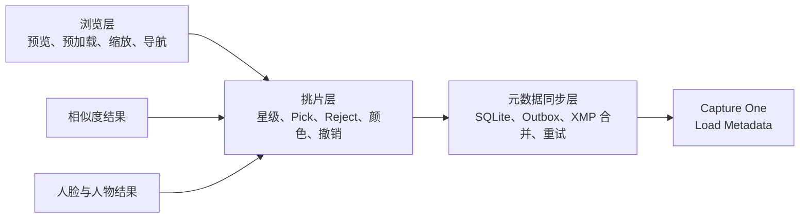
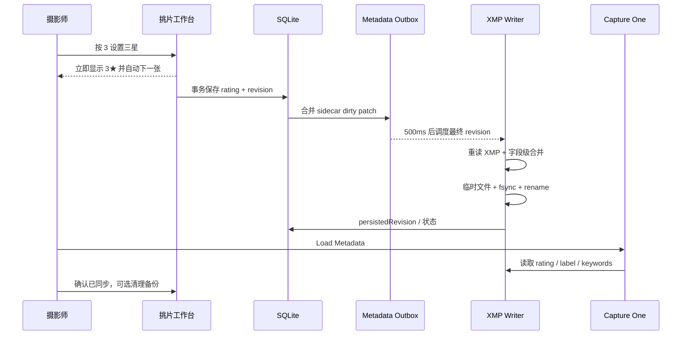
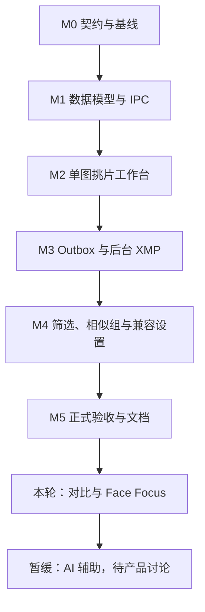

# Gather 挑片工作台：产品设计与执行方案

> 状态：已执行 v1.0
> 日期：2026-07-29
> 代码基线：`feat/select` @ `0cbfc43`
> 适用范围：本地编译、本地使用；暂不讨论安装包、签名和分发

---

## 执行状态（2026-07-29）

- M0～M5 已完成；
- P1（双/四图、同步缩放、人脸区域对齐、组内批量决策）已完成；
- P2 按产品决策暂缓，当前代码未新增 P2 模型、表结构或占位 UI；
- 已完成两轮独立 review：第一轮覆盖功能、状态机和边界，第二轮覆盖并发、
  性能、XMP 耐久性与回归风险；
- `typecheck`、ESLint、99 项 Vitest、正式 production build 全部通过；
- Electron production E2E 实际启动通过 3 项，覆盖导入、二进制图片协议、
  无相似度挑片、rating/label XMP 写入、ExifTool 独立解析和页面渲染；
- 隔离 RAW 人脸全流程 E2E 因未提供本轮专用 RAW/模型环境变量而按测试契约跳过；
  这不影响本轮挑片功能验收；
- 本机检测到 Capture One 16.7.8.16。为避免自动修改用户 Catalog，本轮没有
  代替用户执行 Catalog 内的“Load Metadata”；该项保留在人工验收矩阵中。

---

## 1. 文档目的

本文结合三类输入形成：

1. 用户提出的“浏览层 / 挑片层 / 元数据层”设计意见；
2. Gather 当前代码、数据结构和已有工作流；
3. Capture One、Adobe XMP 与 IPTC 的公开元数据契约。

本文不是从零重写方案，而是回答以下问题：

- Gather 应该成为怎样的产品；
- 当前已经具备什么，真正缺少什么；
- 哪些建议应直接采纳，哪些需要结合现状调整；
- 如何在不破坏现有相似度、人脸和 XMP 写回能力的前提下落地；
- 开发应按什么顺序执行，每一阶段如何验收。

---

## 2. 执行摘要

### 2.1 推荐定位

Gather 不应发展成另一个 Capture One，也不应成为通用 DAM。

推荐定位是：

> Gather 是面向 Capture One 工作流的本地高速预整理工具：利用 RAW
> 内嵌预览完成浏览和挑片，利用相似度与人脸结果辅助人工判断，最终通过
> 标准 XMP sidecar 把星级、颜色和关键词安全交给 Capture One。

核心价值不是“拥有更多页面”，而是将下列闭环做到足够快、足够安全：

```text
导入照片
  → 即时浏览
  → 键盘挑片
  → 相似组 / 人脸辅助复核
  → 后台合并写入 XMP
  → Capture One Load Metadata
```

### 2.2 推荐架构结论

采纳“三层能力”，但不拆成三个应用、三个进程或三套重复状态。



三层共享统一的 Asset、Session、Sidecar 和状态契约。相似度、人脸是挑片的
辅助信号，不是挑片功能的前置条件。

### 2.3 MVP 结论

考虑到 Gather 已经具备 Pick/Reject、颜色写回、相似组和人脸能力，MVP
不必退回到“只做星级”。推荐 MVP 直接闭合：

- 所有 Session 照片均可进入单图挑片，不要求先运行相似度；
- 左右切换、适应窗口、100% 检查、拖拽查看；
- 0～5 星；
- Pick / Reject / Unreviewed；
- Capture One 英文颜色标签；
- 可配置自动前进；
- 单步撤销；
- UI 立即响应，SQLite 先持久化；
- XMP 后台合并写入、可见写盘状态、失败可重试；
- 按星级、颜色、Pick 状态过滤；
- 相似组模式作为同一工作台的可选浏览范围。

双图/四图对比、同步缩放、人脸区域对齐和组内批量决策纳入本轮 P1。闭眼检测、质量排序和 AI 最佳图建议属于 P2；P2 在产品功能和交互契约讨论完成前暂缓，当前实现不得预埋未经确认的模型或 UI 部件。

---

## 3. 设计意见评估

| 原建议 | 决策 | 调整说明 |
|---|---|---|
| 浏览、挑片、元数据三层分离 | 采纳 | 作为能力边界，不拆成独立应用或微服务 |
| UI 先更新内存和数据库，XMP 后台落盘 | 采纳 | 增加持久化 Outbox、revision 和失败状态 |
| 单图查看为第一优先级 | 采纳 | 在现有 Culling 页面演进为统一挑片工作台 |
| 星级与 Pick/Reject 分离 | 采纳 | 星级是交换元数据，Pick 是 Gather 内部决策 |
| Pick/Reject 可映射为颜色 | 调整 | 默认不隐式映射；只在用户选择兼容预设时映射 |
| 颜色只写 `xmp:Label` | 调整 | 做成兼容策略；现代模式只写 Label，兼容模式双写 Urgency |
| 不覆盖整个 XMP | 采纳 | 保留未知 namespace 和字段，只更新 dirty fields |
| 临时文件 + 原子替换 | 采纳并加强 | 当前已有临时文件和 rename，需补 fsync 与同路径串行锁 |
| 300～800ms 防抖写盘 | 采纳 | 推荐默认 500ms，按 XMP 路径合并，不按 photoId 合并 |
| 第一版只实现 0～5 星 | 不完全采纳 | 当前已有 Pick/Reject 和颜色基础，MVP 一并收口成本更低 |
| AI 自动推荐最佳照片 | 延后 | AI 只提供建议，永不直接覆盖用户状态 |

---

## 4. 当前实现审计

### 4.1 已有能力

#### 浏览

- `Gallery.tsx` 已实现 justified layout；
- 已按可见行虚拟化，避免大 Session 一次渲染全部 DOM；
- 缩略图采用 IntersectionObserver 延迟加载；
- `ImageService` 已有内存 + 磁盘两级缓存、并发限制和 in-flight 去重；
- RAW 优先读取内嵌 JPEG，并按目标尺寸选择合适预览；
- Lightbox 已支持前后切换、相邻图片预加载、滚轮缩放和拖拽。

#### 挑片

- 已有 `keep | reject | pending` 决策；
- 已有单张和批量决策 IPC；
- 已有相似组内的单图 Viewer 和 filmstrip；
- 已有 Y / N / 空格以及组间 Tab 导航；
- 决策已持久化到 SQLite。

#### 元数据与 XMP

- `photo_metadata_cache` 已缓存 rating、label 和 keywords；
- XMP 已支持 `dc:subject`、`xmp:Rating`、`xmp:Label`；
- XMP 解析兼容 RDF 属性形式与节点形式；
- 未知 namespace 和非目标字段能够语义保留；
- 写回服务已有 preview、backup、execute、retry、confirm sync 和 cleanup；
- 已处理同名 RAW/JPEG 共用同一个 XMP 路径时的关键词合并；
- 已有 Capture One 颜色标签与 `photoshop:Urgency` 映射；
- XMP 实际样本已通过 ExifTool Validate。

#### 智能辅助

- 相似度分析已有持久化分组和成员索引；
- 人脸检测、编码、聚类和人物绑定已实现；
- 人脸结果最终能合并为 `dc:subject` 关键词；
- ONNX 与重计算任务已移出 Electron 主线程。

### 4.2 当前主要缺口

| 区域 | 当前状态 | 产品影响 |
|---|---|---|
| 单图 Viewer | Lightbox 仅浏览，Culling Viewer 仅显示决策 | 无法在一个界面完成浏览、星级、颜色和人物检查 |
| 挑片范围 | Culling 依赖最新相似度结果，只显示已分组照片 | 未运行相似度或未分组照片无法挑片 |
| 星级与颜色编辑 | 后端可写，挑片 UI 没有逐张编辑模型 | 无法形成职业挑片所需的键盘闭环 |
| 自动前进 | 当前决策后不自动移动 | 高频操作节奏中断 |
| 乐观状态 | mutation 成功后整体 invalidate | 连续按键可能闪烁、乱序或覆盖新状态 |
| 元数据保存 | `MetadataService.setMetadata()` 先同步写文件，再更新缓存 | 单次评分可能被文件 I/O 阻塞 |
| 写盘队列 | 只有显式批量 Writeback，没有持久化 dirty outbox | 不能合并连续操作，也不能崩溃后自动续写 |
| 写盘互斥 | 没有按 XMP 路径的串行锁 | 多模块或同名 RAW/JPEG 可能竞争同一 sidecar |
| 原子耐久性 | 临时文件 + rename 已有，但没有 fsync | 极端断电场景仍可能丢失最后一次写入 |
| 冲突检测 | 写入前会重读，但没有同字段外部修改提示 | Gather 与外部工具同时编辑时无法说明覆盖关系 |
| Undo | 原全局 History 模块已删除 | 当前挑片操作无法撤销 |
| 文档 | README/DEVELOPER/TEST 仍残留旧 Python 架构 | 实施和验收依据与代码不一致 |

### 4.3 必须特别处理的边界：同名 RAW/JPEG

Capture One 对同目录同 basename 的文件使用同一个 sidecar，例如：

```text
IMG_0001.NEF
IMG_0001.JPG
        ↓
IMG_0001.XMP
```

因此：

- Pick/Reject 可以是 photo 级内部状态；
- rating、label、keywords 实际是 sidecar 级交换状态；
- XMP 队列必须以规范化后的 `xmpPath` 为 key；
- 同一 sidecar 下多个 photo 的字段更新必须合并；
- 若两个变体对同一字段给出不同值，UI 必须提示“关联变体共享元数据”，
  不能静默选择其中一个。

这是原建议按 `asset_id` 建队列时没有覆盖、但 Gather 必须解决的问题。

---

## 5. 产品原则

### 5.1 人工判断优先

- AI 只能给出 `recommended`、`qualityScore` 或问题提示；
- 用户的 rating、pickState 和 colorLabel 永远是最终结果；
- AI 重新分析不得覆盖人工状态。

### 5.2 即时交互与最终一致

- 按键后 16ms 级别更新界面；
- SQLite 事务是本地状态持久化边界；
- XMP 是异步交换介质，不是 UI 状态源；
- XMP 失败不能回滚用户已经完成的挑片，只将状态标记为待重试。

### 5.3 字段级所有权

在一次活跃 Gather Session 中：

- Gather 对用户在 Gather 中修改的 dirty fields 负责；
- 外部 XMP 中其他字段与未知 namespace 必须保留；
- 未被 Gather 修改的 rating、label、keywords 不应被重写；
- 同字段发生外部变化时必须检测并明确报告。

### 5.4 不直接修改 Capture One 数据库

- 不读写 `.cocatalogdb` 或 Session 数据库；
- 不假设 Capture One 内部 schema；
- 只通过文件路径导入和标准 XMP sidecar 交换；
- 用户在 Capture One 中执行 Load Metadata，或启用单向 Load。

### 5.5 可恢复优先于“看起来成功”

- 首次修改已有 XMP 前建立备份；
- 临时写入、fsync、原子替换；
- 写入状态、错误和重试次数可见；
- 清理必须在用户确认 Capture One 已加载元数据后发生；
- 不因某张失败而把整个 Session 标为完全成功。

---

## 6. 目标用户流程

### 6.1 默认流程



### 6.2 工作台模式

同一个 Culling Workbench 支持三种 scope：

1. **全部照片**：默认；按当前排序逐张挑片；
2. **当前筛选结果**：例如只看未评星、Rejected 或绿色；
3. **相似组**：利用已有相似度结果，在组内逐张或对比。

没有相似度结果时，前两种模式仍然完整可用。

### 6.3 页面布局

```text
┌──────────────────────────────────────────────────────────────────┐
│ IMG_0001.NEF   3★   绿色   Pick   14 / 860   XMP 已同步          │
├──────────────────────────────────────────────────────────────────┤
│                                                                  │
│                       主预览 / 100% 检查                          │
│                                                                  │
│   [上一张]                                             [下一张]  │
├──────────────────────────────────────────────────────────────────┤
│ 人物：Alice、Bob  关键词：婚礼、室内  相似组：21（第 3 / 8 张） │
├──────────────────────────────────────────────────────────────────┤
│ [filmstrip / 相似组成员 / 当前筛选结果]                           │
└──────────────────────────────────────────────────────────────────┘
```

界面始终只突出三类信息：

- 当前照片是什么；
- 当前人工决策是什么；
- 数据是否已安全保存 / 写入 XMP。

---

## 7. 交互设计

### 7.1 导航与缩放

| 操作 | 默认快捷键 | 说明 |
|---|---:|---|
| 上一张 / 下一张 | `←` / `→` | 在当前 scope 中导航 |
| 上一组 / 下一组 | `Shift+Tab` / `Tab` | 仅相似组模式 |
| 适应窗口 | `F` | fit 模式 |
| 100% 切换 | `Z` | 以真实像素查看 |
| 临时 100% | 按住 `Space` | 松开返回原缩放；不再用 Space 表示 Pending |
| 平移 | 鼠标拖拽 | 仅放大后启用 |
| 关闭 Viewer | `Esc` | 返回网格，并保持当前位置 |

“100%”必须指图像像素与设备像素的明确映射。高 DPI 屏幕下应显示 UI
提示，避免把“CSS 100%”误认为像素级检查。

### 7.2 星级

| 操作 | 快捷键 |
|---|---:|
| 清除星级 | `0` |
| 设置 1～5 星 | `1`～`5` |

- 交换字段：`xmp:Rating`；
- Gather UI 默认只提供 0～5；
- XMP 标准允许 `-1` 表示 rejected，但 Gather 不用它替代 Pick/Reject；
- 用户可同时拥有 `5★ + Pick` 或 `2★ + Reject`。

### 7.3 Pick 状态

| 状态 | 快捷键 | 含义 |
|---|---:|---|
| Picked | `P` | 人工确认保留 |
| Rejected | `X` | 人工确认淘汰 |
| Unreviewed | `U` | 清除 Pick 状态 |

Pick 状态默认只保存在 Gather 数据库。不得自动覆盖 rating。

可提供显式预设：

- Picked → Green；
- Rejected → Red；

该预设必须由用户开启，并在 UI 中显示映射结果，不能作为隐藏规则。

### 7.4 颜色标签

内部使用稳定英文枚举，UI 本地化显示：

| 内部 / XMP | 中文显示 | 建议快捷键 |
|---|---|---:|
| `None` | 无 | `Cmd/Ctrl+0` |
| `Red` | 红色 | `6` |
| `Yellow` | 黄色 | `7` |
| `Green` | 绿色 | `8` |
| `Blue` | 蓝色 | `9` |
| `Purple` | 紫色 | 颜色面板 |
| `Pink` | 粉色 | 颜色面板 |
| `Orange` | 橙色 | 颜色面板 |

快捷键后续可配置；第一版不应为覆盖全部颜色而引入复杂组合键。

### 7.5 自动前进

设置项：

```text
autoAdvance:
  enabled: true
  onRating: true
  onPickState: true
  onColorLabel: false
  wrapAtEnd: false
```

规则：

- UI 状态更新后立即前进，不等待 XMP；
- SQLite 写入失败时回滚该张状态并停止自动前进；
- 到达 scope 末尾默认停止，不自动循环；
- 当前过滤条件会因评分而移除照片时，先按原顺序确定下一张；
- 连续按键必须按客户端 revision 串行提交，旧响应不得覆盖新状态。

### 7.6 撤销

MVP 提供 Session 内单步 / 多步命令栈：

- `Cmd/Ctrl+Z` 撤销最近一次 rating、pickState 或 colorLabel 修改；
- 撤销同样生成新 revision，而不是删除历史 revision；
- 如果旧值已经写入 XMP，Writer 在下一轮写入撤销后的最终值；
- 第一版不要求应用重启后继续撤销，但数据库最终状态必须正确。

不恢复已删除的全局 HistoryService。撤销仅服务于高频挑片命令，保持边界清晰。

---

## 8. 状态与数据模型

### 8.1 领域模型

```typescript
type PickState = 'unreviewed' | 'picked' | 'rejected'

type CaptureOneColorLabel =
  | 'None'
  | 'Red'
  | 'Orange'
  | 'Yellow'
  | 'Green'
  | 'Blue'
  | 'Pink'
  | 'Purple'

interface AssetCullingState {
  photoId: string
  pickState: PickState
  rating: 0 | 1 | 2 | 3 | 4 | 5
  colorLabel: CaptureOneColorLabel
  revision: number
  updatedAt: string
}

interface MetadataSyncState {
  xmpPath: string
  dirtyFields: Array<'rating' | 'label' | 'keywords'>
  desiredPatch: {
    rating?: number
    label?: string
    keywords?: string[]
  }
  revision: number
  persistedRevision: number
  status: 'clean' | 'pending' | 'writing' | 'failed' | 'conflict'
  attemptCount: number
  errorMessage: string
  baseFingerprint: string
}
```

注意：`AssetCullingState` 是 photo 级交互状态；`MetadataSyncState` 以
`xmpPath` 为 key，是 sidecar 级交换状态。

### 8.2 数据库演进

优先复用现有 `culling_decisions`，降低迁移风险：

```sql
ALTER TABLE culling_decisions
  ADD COLUMN rating INTEGER NOT NULL DEFAULT 0;

ALTER TABLE culling_decisions
  ADD COLUMN color_label TEXT NOT NULL DEFAULT 'None';

ALTER TABLE culling_decisions
  ADD COLUMN revision INTEGER NOT NULL DEFAULT 0;
```

现有映射：

```text
pending → unreviewed
keep    → picked
reject  → rejected
```

协议层使用新名称，数据库可暂时保留旧列名，避免一次性重建表。

新增持久化 Outbox：

```sql
CREATE TABLE metadata_outbox (
  xmp_path TEXT PRIMARY KEY,
  owner_session_id TEXT NOT NULL,
  patch_json TEXT NOT NULL DEFAULT '{}',
  dirty_fields TEXT NOT NULL DEFAULT '[]',
  revision INTEGER NOT NULL DEFAULT 0,
  persisted_revision INTEGER NOT NULL DEFAULT 0,
  base_fingerprint TEXT NOT NULL DEFAULT '',
  status TEXT NOT NULL DEFAULT 'pending',
  attempt_count INTEGER NOT NULL DEFAULT 0,
  error_message TEXT NOT NULL DEFAULT '',
  updated_at TEXT NOT NULL
);

CREATE INDEX idx_metadata_outbox_session_status
  ON metadata_outbox(owner_session_id, status);
```

约束：

- rating 必须为 0～5；
- color label 必须属于允许枚举；
- `revision >= persisted_revision`；
- `clean` 时两者相等；
- 同一 `xmp_path` 始终只有一个待写 patch。
- 若另一个 Session 对同一路径已有未完成 patch，新写入必须停止并提示冲突，
  不能通过覆盖 `owner_session_id` 抢占任务。

Outbox 不用 photo 外键作为生命周期锚点：同一个 sidecar 可能服务多个 RAW/JPEG
变体，删除其中一个 photo 不能级联删除其他变体仍需要的待写任务。

### 8.3 与现有表的关系

| 表 | 目标职责 |
|---|---|
| `culling_decisions` | 用户的 photo 级挑片状态 |
| `photo_metadata_cache` | 从 embedded/XMP 读取后的查询投影 |
| `metadata_outbox` | 尚未完全写入 sidecar 的最终字段 patch |
| `writeback_items` | 批量写回审计、备份、同步确认与清理 |
| `similarity_result_members` | 可选的相似组导航范围 |
| 人脸相关表 | 人物提示与关键词来源 |

`photo_metadata_cache` 不是用户修改的唯一真相，不应承担 dirty queue。

---

## 9. 状态更新与并发模型

### 9.1 单次按键事务

```text
Renderer optimistic update
  → IPC culling.update
  → SQLite transaction:
       1. validate session/photo ownership
       2. update culling state + revision
       3. merge metadata_outbox patch
       4. return authoritative state
  → Renderer reconcile
```

如果 DB 事务失败：

- 恢复 UI 旧值；
- 停止本次自动前进；
- 显示明确错误；
- 不产生 Outbox 任务。

### 9.2 Revision 规则

- 每次用户命令增加 revision；
- IPC 带 `expectedRevision`；
- 后端发现旧 revision 时返回冲突，而不是覆盖新值；
- Renderer 对同一 photo 的命令顺序提交；
- 对不同 photo 可以并行；
- Writer 只写当前最高 revision；
- Writer 完成旧 revision 时，若数据库已有更新 revision，状态仍保持 pending。

### 9.3 XMP Writer 调度

推荐参数：

```text
debounceMs = 500
maxConcurrency = 2
maxAttempts = 5
retryBackoff = 1s, 2s, 5s, 15s, 30s
```

队列规则：

- 以规范化 `xmpPath` 去重；
- 同一路径严格串行；
- 不同路径最多并发 2；
- 显式的人脸/相似度批量 Writeback 生命周期优先；同一路径存在活动批量任务时，
  Culling Outbox 暂停，避免两套备份与清理语义交叉；
- 连续 `1 → 3 → 4` 只写最终 rating=4；
- rating、label、keywords 的 patch 做字段级合并；
- 应用退出时不强制等待全部 XMP 完成，Outbox 已持久化；
- 下次启动自动恢复 `pending / writing / failed-retryable`；
- `writing` 在异常退出后恢复为 `pending`。

### 9.4 外部修改冲突

写入前计算当前 sidecar fingerprint，例如：

```text
size + mtimeMs + SHA-256
```

策略：

1. XMP 未变化：正常写；
2. XMP 变化但 Gather dirty fields 未变化：重读后合并，继续写；
3. XMP 中同一 dirty field 也变化：标记 `conflict`；
4. 用户选择：
   - 使用 Gather 值；
   - 接受外部值；
   - 查看差异后逐字段处理。

MVP 可先实现前两项，并在第三项停止自动写入、给出错误；不能静默覆盖。

---

## 10. XMP 写入契约

### 10.1 字段映射

| Gather 字段 | XMP 字段 | 规则 |
|---|---|---|
| rating | `xmp:Rating` | 0～5；不使用 -1 承载内部 Reject |
| colorLabel | `xmp:Label` | 始终写英文 |
| keywords | `dc:subject/rdf:Bag` | 去重，保留普通字符串词法值 |
| 人物名称 | `dc:subject/rdf:Bag` | 与已有关键词做并集 |
| Pick state | 默认不写 | 可由显式兼容预设映射颜色 |

### 10.2 颜色兼容策略

新增设置：

```typescript
type ColorCompatibilityMode =
  | 'xmp_label_only'
  | 'capture_one_label_and_urgency'
```

#### `xmp_label_only`

- 只写 `xmp:Label`；
- 推荐给 Capture One 16.5.6+；
- 指引用户关闭 “Synchronize IPTC Urgency with Color Tag”；
- 副作用最小。

#### `capture_one_label_and_urgency`

- 同时写 `xmp:Label` 和 `photoshop:Urgency`；
- 用于旧版或需要联动的工作流；
- 保留当前 Gather 行为，避免现有用户升级后行为突变。

迁移建议：

- 已有用户保持双写；
- 新用户首次进入时选择兼容模式；
- 在完成真实 Capture One 版本矩阵测试前，不静默改变默认值。

### 10.3 增量合并

每次写入必须：

1. 读取最新 XMP；
2. 验证 XML 可解析；
3. 定位目标 RDF property；
4. 只替换 dirty fields；
5. 保留未知 namespace、未知字段和其他 `rdf:Description`；
6. 防止属性式和节点式产生重复 property；
7. 写入临时文件；
8. `FileHandle.sync()`；
9. 关闭文件；
10. 原子 rename/replace；
11. 必要时同步目录项；
12. 更新 persisted revision。

“保留”指语义保留，不保证原始 XML 的缩进、属性顺序和字节完全一致。

### 10.4 备份生命周期

- 第一次修改已有 sidecar 时创建唯一备份；
- 同一写回周期后续更新复用初始备份；
- Gather 新建的 sidecar 记录“原文件不存在”；
- Capture One Load Metadata 后用户点击“确认同步”；
- 用户可选择：
  - 保留 XMP，继续作为跨软件元数据；
  - 恢复原 XMP / 删除 Gather 新建 XMP；
- 未确认同步前禁止清理。

### 10.5 Capture One 推荐设置

现代单向工作流：

```text
Auto Sync Sidecar XMP = Load
Prefer Sidecar XMP over Embedded Metadata = On
Synchronize IPTC Urgency with Color Tag =
  - xmp_label_only 模式：Off
  - 双写兼容模式：按用户现有流程决定
```

不推荐 Full Sync。Capture One 官方也提示大集合下 Full Sync 会影响性能；
Gather 的设计中 XMP 是单向交付通道，应避免双方后台同时写同一个 sidecar。

---

## 11. 模块设计

### 11.1 Renderer

新增或改造：

```text
pages/SessionDetail/Culling.tsx
  └─ CullingWorkbench
      ├─ CullingHeader
      ├─ PhotoViewer
      ├─ DecisionOverlay
      ├─ MetadataStrip
      ├─ ScopeFilmstrip
      └─ SyncStatus

stores/cullingStore.ts
  ├─ 当前 scope 与位置
  ├─ 乐观状态
  ├─ per-photo command queue
  ├─ undo stack
  └─ auto-advance settings
```

复用：

- `Lightbox` 的缩放和平移逻辑；
- `Gallery` 的虚拟化和缩略图组件；
- `imageApi` 的 preview/thumbnail/preload；
- Toast 和统一 Dialog。

不建议长期维护 Gallery Lightbox 和 Culling Viewer 两套缩放实现。应抽取一个
`PhotoViewer`，但只抽取确定共享的预览、缩放、平移和加载状态，不建立大型
“万能 Viewer 框架”。

### 11.2 Main Process

```text
CullingService
  ├─ listScope()
  ├─ updateState()
  ├─ batchUpdate()
  └─ getSummary()

MetadataOutboxService
  ├─ mergePatch()
  ├─ flushSession()
  ├─ retryFailed()
  └─ recoverInterrupted()

MetadataSyncCoordinator
  ├─ debounce by xmpPath
  ├─ per-path lock
  ├─ bounded concurrency
  └─ conflict detection

XmpSidecarWriter
  ├─ read latest
  ├─ patch dirty fields
  ├─ fsync + atomic replace
  └─ backup / restore
```

`WritebackService` 继续负责批量审计、确认同步和清理。Outbox 不重新实现第二套
XMP 解析器，而是调用同一个 `XmpSidecarWriter`。

### 11.3 IPC / Shared Protocol

推荐最小命令集：

```typescript
type CullingScope = 'all' | 'filtered' | 'similarity_group'

interface CullingListParams {
  sessionId: string
  scope: CullingScope
  filters?: CullingFilters
  groupId?: string
}

interface CullingUpdateParams {
  sessionId: string
  photoId: string
  expectedRevision: number
  patch: {
    rating?: number
    pickState?: PickState
    colorLabel?: CaptureOneColorLabel
  }
}

interface CullingBatchUpdateParams {
  sessionId: string
  photoIds: string[]
  patch: CullingUpdateParams['patch']
}

interface MetadataFlushParams {
  sessionId: string
}

interface MetadataSyncStatusParams {
  sessionId: string
}
```

返回状态必须包含：

```typescript
interface CullingAsset {
  photo: PhotoData
  state: AssetCullingState
  syncStatus: MetadataSyncState['status']
  people: string[]
  keywords: string[]
  similarityGroupId?: string
  linkedVariantCount: number
}
```

兼容策略：

- 保留现有 `culling.decide` 和 `culling.batch_decide`；
- 新 UI 切换到 `culling.update`；
- 完成一个版本迁移和测试后再删除旧命令。

---

## 12. 预览与预加载策略

### 12.1 优先级

```text
P0：当前 Viewer 图片
P1：下一张、上一张
P2：后续 2～4 张
P3：filmstrip / 网格可见缩略图
```

当前代码只预加载相邻一张。目标策略应根据操作方向动态调整：

- 连续向右时预加载后 4 张、前 1 张；
- 改变方向后取消或降低旧方向任务优先级；
- 相似组很小时整组预加载；
- 复用现有 in-flight 去重与磁盘缓存；
- 不为预加载启动无界 `sips` 或 RAW 解码任务。

### 12.2 RAW 策略

保持当前顺序：

1. RAW 索引命中的嵌入 JPEG segment；
2. 扫描并选择满足目标尺寸的嵌入 JPEG；
3. ExifTool 容器级提取；
4. 最后才使用 `sips` RAW 渲染。

挑片 Viewer 的目标是评估构图、表情与清晰度，不做 RAW 调色。内嵌 JPEG
与相机 Picture Style 不同于 Capture One RAW 渲染属于预期差异，UI 应在帮助
文档中说明。

### 12.3 100% 检查

- 优先选择 RAW 中分辨率最高的内嵌 JPEG；
- 如果内嵌预览不足以支持当前显示倍率，显示“内嵌预览分辨率不足”；
- 不应悄悄把低分辨率 JPEG 放大后仍标为可信的 100%；
- 后续 Face Focus 使用已有 face bbox，将视口定位到人脸区域，不重新做人脸检测。

---

## 13. 相似度和 AI 的产品位置

### 13.1 相似度

相似度是导航和比较结构，不是写回内容。

第一阶段：

- 当前组 filmstrip；
- 组内 Pick/Reject；
- 一键 Pick 当前、Reject 组内其余；
- 所有动作仍需用户触发。

第二阶段：

- 双图 / 四图对比；
- 同步缩放和平移；
- 人脸区域对齐；
- 组内按清晰度或 AI score 排序。

### 13.2 AI 建议

建议字段：

```typescript
interface CullingAssist {
  qualityScore?: number
  recommended?: boolean
  warnings: Array<
    | 'eyes_closed'
    | 'face_out_of_focus'
    | 'motion_blur'
    | 'exposure_issue'
    | 'duplicate_candidate'
  >
  modelVersion: string
}
```

规则：

- 与人工状态分表或分字段；
- 模型升级可重算；
- 人工状态不得被重算；
- UI 使用“建议”“可能”措辞；
- 自动 Reject 不进入默认产品流程。

---

## 14. 执行计划

### 14.1 总体顺序



### 14.2 M0：契约与基线（0.5～1 人日）

目标：冻结产品语义，避免实现过程中反复改模型。

任务：

- 确认 rating、pickState、colorLabel 三者独立；
- 确认默认自动前进触发条件；
- 确认现代 / 兼容颜色写回模式；
- 确认同名 RAW/JPEG 的 UI 表达；
- 为当前 Culling、XMP、Gallery 增加基线测试；
- 修订过时的 `README_CN.md`、`DEVELOPER.md`、`TEST.md` 架构描述。

退出条件：

- 本文第 18 节决策全部批准；
- 当前测试基线稳定；
- 没有未定义的字段映射。

### 14.3 M1：数据模型与 IPC（2～3 人日）

修改范围：

- `desktop/src/main/db/schema.ts`
- `desktop/src/main/db/migrations.ts`
- `desktop/src/main/db/repositories/culling-decision.repo.ts`
- 新增 `metadata-outbox.repo.ts`
- `packages/shared/src/protocol/culling.ts`
- `desktop/src/main/ipc/culling.ipc.ts`
- `desktop/src/main/services/culling/culling.service.ts`

任务：

- 增加 rating、color label、revision；
- 增加 metadata outbox；
- Culling list 覆盖所有 Session 照片；
- 相似组变成可选 scope；
- 增加 ownership、revision、枚举校验；
- 为同 XMP 路径的 linked variants 建立检测；
- 保留旧 IPC 兼容。

测试：

- 空 Session；
- 未运行相似度；
- grouped + ungrouped 混合；
- 非本 Session photoId；
- revision 冲突；
- 同名 RAW/JPEG；
- migration 重复执行。

退出条件：

- 任意 Session 可读取完整挑片列表；
- DB 更新与 Outbox 合并在同一事务中；
- 旧 Culling 页面仍可运行。

### 14.4 M2：单图挑片工作台（3～5 人日）

修改范围：

- `Culling.tsx` / `Culling.module.css`
- 新增 `stores/cullingStore.ts`
- 抽取 `components/PhotoViewer`
- 复用 Gallery thumbnail / image API

任务：

- 单图 Viewer；
- fit / 100% / pan；
- 0～5 星；
- P / X / U；
- 颜色面板与 6～9；
- 自动前进；
- optimistic update + reconcile；
- undo stack；
- 写盘状态 badge；
- 当前、前后和方向性预加载。

测试：

- 快捷键焦点隔离；
- 连续快速按键；
- mutation 乱序；
- DB 失败回滚；
- 自动前进边界；
- 过滤列表中评分后位置保持；
- Viewer 关闭后网格位置保持。

退出条件：

- 不运行相似度也能完成完整人工挑片；
- 持续每秒 5 次操作无丢失、无明显卡顿；
- 页面刷新后状态仍在。

### 14.5 M3：Outbox 与后台 XMP（3～5 人日）

修改范围：

- 新增 `MetadataOutboxService`
- 新增 `MetadataSyncCoordinator`
- `WritebackService`
- `XmpSidecarWriter`
- `xmp-utils.ts`
- 应用启动与 shutdown 生命周期

任务：

- 500ms 合并；
- 按 xmpPath 串行锁；
- 并发上限；
- crash recovery；
- 指数退避重试；
- 同字段外部冲突检测；
- 初次写入备份复用；
- `FileHandle.sync()` + atomic replace；
- 同名 RAW/JPEG patch 合并；
- 实时状态事件。

测试：

- `1 → 3 → 4` 只落最终值；
- rating + label + keywords 并发合并；
- 两个模块写同一 sidecar；
- XMP 在等待期间被外部修改；
- 写临时文件失败；
- rename 失败；
- 应用崩溃后恢复；
- 重试后 persisted revision 正确；
- ExifTool Validate；
- Capture One 实际 Load Metadata。

退出条件：

- UI 不等待 XML 解析或文件写入；
- 所有失败项可定位、可重试；
- 未知 XMP 字段不丢失；
- 同一路径不会并发写。

### 14.6 M4：筛选、相似组与兼容设置（2～3 人日）

任务：

- rating / label / pickState 过滤；
- “只看未处理”；
- all / filtered / similarity group scope；
- 当前 Pick、Reject、星级汇总；
- Pick → Green、Reject → Red 显式预设；
- `xmp_label_only` / 双写兼容设置；
- Capture One 设置引导；
- 批量应用到当前选中 / 当前组。

退出条件：

- 用户可以完成第一轮、第二轮筛选；
- 相似组模式不影响普通挑片；
- 写回策略在 UI 中可解释。

### 14.7 M5：生产验收与文档（2～3 人日）

自动化：

```bash
npm run build
npm run typecheck
npm run test:vitest
npm run lint
npm run test:e2e
git diff --check
```

人工：

- 真实 RAW/JPEG 混合 Session；
- 至少 500 张照片；
- 至少两种 RAW 格式；
- Capture One 当前版本；
- 既有复杂 XMP；
- XMP 无写权限；
- 外置磁盘断开；
- 应用强制退出并恢复。

退出条件见第 15 节。

### 14.8 P1 与暂缓阶段

#### P1：相似组对比与 Face Focus

- 双图 / 四图；
- 同步缩放；
- 人脸 bbox 对齐；
- 组内一键保留当前、淘汰其他。

P1 与 M0～M5 在同一执行轮次完成并共同验收。

#### P2：AI 辅助

- 闭眼、失焦、曝光问题提示；
- 组内质量排序；
- 推荐候选；
- 模型版本与重算状态；
- 不自动改变人工决策。

P2 本轮明确暂缓。由于提示部件、质量指标、排序方式、模型来源和用户确认机制尚未形成产品契约，当前版本不创建占位入口、不新增 AI 表结构，也不让 P2 阻塞核心挑片闭环。

---

## 15. 验收标准

### 15.1 功能

- [ ] 未运行相似度时可挑选所有照片；
- [ ] 0～5 星、Pick、Reject、颜色互不覆盖；
- [ ] 自动前进可配置且顺序正确；
- [ ] Cmd/Ctrl+Z 可撤销；
- [ ] 页面刷新后状态不丢失；
- [ ] XMP 失败不丢失 DB 决策；
- [ ] 失败项可重试；
- [ ] Capture One 能读取 rating、label、keywords；
- [ ] 同名 RAW/JPEG 不产生互相覆盖；
- [ ] 未知 XMP 字段保持；
- [ ] 用户确认同步前不能清理。

### 15.2 性能

| 指标 | 目标 |
|---|---:|
| 按键到视觉反馈 p95 | `< 50ms`，目标 `< 16ms` |
| 缓存命中时下一张可见 p95 | `< 100ms` |
| 内嵌预览首次显示 p95 | `< 500ms`，视磁盘与 RAW 而定 |
| SQLite 单次状态事务 p95 | `< 20ms` |
| 连续输入 | `>= 5 actions/s` 无丢失 |
| XMP writer 并发 | 默认 `2` |
| 500 张 Session 导航 | 无明显输入阻塞 |

性能数据应在正式构建中采集，不以开发模式 HMR 结果为准。

### 15.3 XMP 安全

- [ ] 原文件损坏时拒绝覆盖；
- [ ] 写入后 ExifTool `Validate OK`；
- [ ] Rating 只出现一次；
- [ ] Label 只出现一次；
- [ ] Keywords 为 `dc:subject/rdf:Bag`；
- [ ] 复杂多 namespace XMP 语义不丢失；
- [ ] 临时文件不会长期残留；
- [ ] 已有 sidecar 有可恢复备份；
- [ ] 断电模拟后原文件或新文件至少一个完整可解析。

### 15.4 Capture One 人工矩阵

| 场景 | 预期 |
|---|---|
| Auto Sync = Load | Gather 更新后 C1 可加载 |
| 手动 Image → Load Metadata | rating / label / keywords 出现 |
| Label only + Urgency sync Off | 颜色正确、Urgency 不被修改 |
| 双写兼容模式 | 颜色与 Urgency 映射符合预期 |
| Full Sync | 显示风险提示，不作为推荐流程 |
| RAW + JPG 同 basename | UI 显示关联，元数据不冲突 |

---

## 16. 风险与缓解

| 风险 | 等级 | 缓解 |
|---|---:|---|
| 连续 mutation 响应乱序 | P0 | per-photo command queue + revision |
| 同一 XMP 多写者竞争 | P0 | xmpPath 串行锁 + 写前 fingerprint |
| RAW/JPEG 共用 XMP | P0 | sidecar 级 Outbox + linked variant 提示 |
| 外置盘断开 | P0 | DB 状态保留，Outbox failed，可重试 |
| XMP 未 fsync | P1 | FileHandle.sync + atomic rename |
| 颜色标签跨软件不一致 | P1 | 英文枚举 + 可选兼容模式 |
| 过滤后自动前进跳错 | P1 | 在 mutation 前计算稳定 next id |
| 人脸/相似度结果过期 | P1 | 仅作辅助，不影响人工状态 |
| 两套 Viewer 漂移 | P2 | 抽取小型共享 PhotoViewer |
| 文档持续过期 | P2 | M0/M5 同步更新并纳入 PR 清单 |

---

## 17. 明确不做

MVP 不包含：

- RAW 调色和渲染；
- Capture One Catalog 数据库写入；
- 自动删除或移动 Reject 文件；
- AI 自动 Reject；
- 云同步和多人协作；
- 完整 Lightroom / Photo Mechanic 兼容矩阵；
- 可配置所有快捷键；
- 应用分发、签名、公证和自动更新。

这些内容不能阻塞核心挑片闭环。

---

## 18. 需要评审确认的决策

建议按以下默认项批准：

1. **产品定位**：Capture One 前置高速挑片与元数据增强工具；
2. **MVP 范围**：星级 + Pick/Reject + 颜色 + 自动前进 + Undo；
3. **挑片入口**：改造现有 Culling 页面，不新增平行的第二套挑片页面；
4. **相似度关系**：相似组是可选 scope，不再是 Culling 前置条件；
5. **状态权威**：SQLite 为交互状态权威，XMP 为异步交换通道；
6. **默认写盘**：500ms 后台 debounce，失败不回滚人工状态；
7. **颜色模式**：提供 Label-only 与 Label+Urgency 两种模式；
8. **Pick 映射**：默认不写入 XMP；颜色映射必须显式开启；
9. **Reject 与 Rating**：Reject 不自动写 `xmp:Rating=-1`；
10. **同名 RAW/JPEG**：交换元数据按共享 sidecar 合并并提示关联；
11. **清理**：仅在用户确认 Capture One 已加载后允许；
12. **AI**：只建议，不自动修改人工决策。

若上述 12 项不发生变化，可以直接按 M0 → M5 → P1 执行；P2 必须在单独设计评审后再进入开发。

---

## 19. 参考资料

- [Capture One：Culling images](https://support.captureone.com/hc/en-us/articles/7185822431645-Culling-images)
- [Capture One：Rating and tagging](https://support.captureone.com/hc/en-us/articles/360002743718-Rating-and-tagging)
- [Capture One：Metadata in XMP sidecar files](https://support.captureone.com/hc/en-us/articles/360002544898-Metadata-in-XMP-sidecar-files)
- [Capture One：Preferences / Settings Image tab](https://support.captureone.com/hc/en-us/articles/360002484457-Capture-One-Preferences-Settings-Image-tab)
- [Capture One：Keywords overview](https://support.captureone.com/hc/en-us/articles/360002544178-Keywords-overview)
- [Adobe：XMP Basic namespace](https://developer.adobe.com/xmp/docs/xmp-namespaces/xmp/)
- [Adobe：Dublin Core namespace](https://developer.adobe.com/xmp/docs/xmp-namespaces/dc/)
- [IPTC Photo Metadata Standard 2024.1](https://www.iptc.org/std/photometadata/specification/IPTC-PhotoMetadata-2024.1.html)
