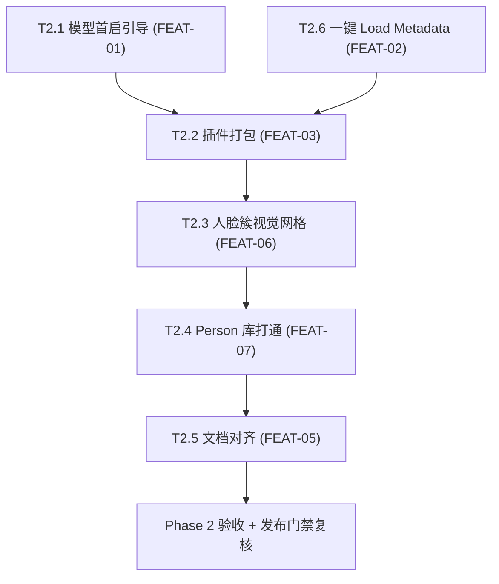

# Gather 功能补全 — 设计与执行

> 状态：Phase 2 第一优先级（T2.1~T2.6）已完成；第二优先级（测试盲区）与第三优先级（架构债务）待排期
> 文档版本：v2.2
> 日期：2026-08-04
> 代码基线：`main`（含 Phase 1 可靠性 Bug 修复 + Phase 2 第一优先级功能）
> 来源：架构 / 代码 / 用户 / 测试四视角 Review（2026-08-04）
> 原则：所有改动遵守 docs/DEVELOPMENT.md 既定约定（平台逻辑只在组合根、
> React Query 持有服务端状态、推送优先、迁移不变量）。每阶段保持应用可启动、
> 旧库可读、现有工作流可用。

---

## 0. 变更记录

### v2.2（2026-08-04）Phase 2 第一优先级全部完成

第一优先级的 6 项功能（T2.1~T2.6）已全部实现并通过验证（typecheck / lint /
203 单测 / 12 e2e / benchmark）。完成情况：

| 任务 | 状态 | 说明 |
|------|------|------|
| T2.1 FEAT-01 人脸模型首启引导 | ✅ 完成 | 新增 `face.models_status` 命令 + StepAnalyze 引导卡片 + 跳转设置 |
| T2.2 FEAT-03 插件随发布打包 | ✅ 完成 | `afterPack` 钩子打包 `GatherLink.coplugin`（无 SDK 降级）；顺带修复 Makefile 括号路径缺陷 |
| T2.3 FEAT-06 人脸簇审核视觉网格 | ✅ 完成 | StepReview 批量预取成员缩略图 |
| T2.4 FEAT-07 Person 库打通 | ✅ 完成 | `fkw.bind` 自动 upsert person + 关联照片；解绑/合并/移除成员自动对账；Persons 页可跳转对应工作区审核并按角色筛选 |
| T2.5 FEAT-05 文档与产品对齐 | ✅ 完成 | README / README_CN / TEST 已按 3 步人脸流程与关键词写回对齐 |
| T2.6 FEAT-02 一键 Load Metadata | ✅ 完成 | Culling / Similarity / StepWriteback 三处按钮 |

### v2.3（2026-08-04）T2.1~T2.6 复核修复与验收补全

对 T2.1~T2.6 的实现做四视角复核后修复缺陷并补齐验收（typecheck / lint /
203 单测 / 12 e2e 通过）：

- Person 库：`person_photos` 新增 `(person_id, photo_id)` 唯一索引（迁移 v28），
  修复重复绑定/合并导致照片数虚增；解绑、合并簇、移除成员后按当前角色绑定
  对账 person↔照片；`upsertByName` 重新绑定时合并关键词而非丢弃。
- 模型状态：`face.models_status` 与 `settings.get_ml_status` 共用
  `getFaceModelPresence`，消除 presence 逻辑漂移。
- 清理死代码：移除已被簇网格整图缩略图取代的人脸裁剪缩略图管线
  （`fkw.get_cluster_thumbnail` 命令、渲染 API、协议与生成逻辑）。
- 渲染层：StepWriteback 渲染写回结果消息并拆分 reload 忙碌态；Culling 的
  Load Metadata 按钮仅在 `written>0` 时显示；审核网格去掉每卡片独立
  IntersectionObserver；WritebackReport 支持 disabled。
- 打包：`afterPack.cjs` 构建失败软降级、目标架构跟随应用、`make clean` 防
  陈旧产物；`docs/DEVELOPMENT.md` 打包章节同步为已实现状态。
- 验收补全：新增 PersonRepository 真库单测、`getFaceModelPresence` 单测、
  无模型引导卡 e2e、Culling Load Metadata 按钮 e2e；迁移 e2e 修正到 v28。

### v2.0（2026-08-04）Phase 1 可靠性 Bug 已修复并移出本文档

原 v1.0 的 Phase 1 可靠性 Bug（BUG-01 ~ BUG-08）已经二次 Review 验证并修复，
本文档只保留 Phase 2 功能补全计划。Phase 1 结论记录如下（含验证判定）：

| Bug | 判定 | 处理 |
|-----|------|------|
| BUG-01 幽灵照片（indexer 增量扫描） | 条件成立（真实缺陷） | 已修复：`discoveredSet.add` 移到 `stat()` 成功后 |
| BUG-02 人脸观测先删后跑 | 真实 | 已修复：推理成功后才原子替换观测 |
| BUG-03 大/损坏 RAW 主进程卡死 | 条件成立 | 已修复：段扫描改单遍线性 + 整读大小上限 |
| BUG-04 Capture One 进程名校验过严 | 真实 | 已修复：sanitizer 允许真实版本命名 |
| BUG-05 `waitForResult` 永久挂起 | 条件成立 | 已修复：超时 + waiter 清理 |
| BUG-06 调度器并发上限竞态 | 误报 | 未改（微任务 FIFO 保证不超限） |
| BUG-07 聚类 worker 挂起/泄漏 | 条件成立 | 已修复：超时 + exit 兜底 + 注入工厂 |
| BUG-08a mtime 缓存键 | 影响可忽略 | 未改 |
| BUG-08b metadata-mutation 链 | 误报 | 未改（`currentTurn` 永不 reject） |
| BUG-08c export 大小写 | 误报 | 未改（destPath 恒同源构建） |
| BUG-08d app:scan-directory 无界 | 真实 | 已修复：50k 文件上限 |
| BUG-08e culling groupId NaN | 正常流不可达 | 未改 |

---

## 1. 文档目的

把四视角 Review 中尚未完成的 **Phase 2 功能补全**（FEAT-01 ~ FEAT-07）转化为
可实施、可验收的工程计划：让"Send to Gather → 挑片 → 写回 → Load Metadata"
首套流程零配置跑通，并消除文档与产品的落差。

每项任务同时给出：现状与设计（设计依据）、涉及文件、关键改动、测试与验收条件。

---

## 2. 执行顺序总览

关键路径：T2.1（模型引导）、T2.2（插件打包）、T2.3（簇网格）、T2.4（Person）、
T2.6（一键 Load Metadata）相互独立可并行；T2.5（文档对齐）可在功能稳定后收尾。

---

## 3. Phase 2 — 功能补全

### T2.1 / FEAT-01 人脸模型首次运行引导

**现状**：模型缺失时 `fkw.analyze` 直接失败（`face-kw.ipc.ts:48-49` 取
settings 默认路径，`resolveModelPath` 找不到即抛错），`StepAnalyze.tsx`
只显示错误文本，无任何指引；模型下载 UI 深藏在 `Settings/index.tsx:306-327`。

**设计**：

1. 新增 `face.models_status` 命令：返回
   `{ detectorPresent, encoderPresent, detectorPath, encoderPath, versions }`
   （版本指纹复用 `face-kw.service.ts` 已有的 `modelFingerprint`）。
2. `StepAnalyze.tsx` 挂载时查询状态；缺失时在面板顶部显示内联引导卡片：
   "人脸模型未安装 → 打开设置自动下载（约 182 MB）"。
3. "去设置"按钮跳转 Settings 模型面板；面板复用现有
   `models.download_default` 命令 + `models:download-progress` 事件显示进度。
4. `fkw.analyze` 失败时若根因是模型缺失，把错误文案与引导一并返回。

**关键改动文件**：`desktop/src/main/ipc/face-kw.ipc.ts`（新增 `face.models_status`）、
`desktop/src/renderer/pages/FaceKeywording/StepAnalyze.tsx`、
`desktop/src/renderer/pages/Settings/index.tsx`

**测试**：`getFaceModelPresence` 单测（共享 presence 逻辑）；无模型场景 e2e 断言引导卡片
出现、跳转可用；模型存在时不显示。

**验收**：e2e/单测通过；手工核验下载进度条。

---

### T2.2 / FEAT-03 Capture One 插件随发布打包

**现状**：`GatherLink.coplugin` 需手动 `make all && make install`
（`desktop/coplugin/Makefile`），发布包未附带，"Send to Gather"对普通用户
不可用。

**设计**：

1. electron-builder 增加 `afterPack` 钩子（或打包脚本）：当宿主机存在
   Capture One SDK（`Capture_One_Plugin_SDK_*/`）时编译插件并放进
   `extraResources` 的 `plugins/`；SDK 缺失时**跳过并打印警告**（不阻断
   主包发布）。
2. 在 README/发布说明提供一键安装：将 `plugins/GatherLink.coplugin`
   复制到 `~/Library/Application Support/Capture One/Plug-ins/` 并重启 C1。
3. 插件签名/公证不在本期范围（记录为已知限制）。

**关键改动文件**：`desktop/electron-builder.yml`（afterPack 钩子）、
`desktop/scripts/afterPack.cjs`（新建，mac 专用）

**测试**：本机 `npm run build` + 检查产物 bundle 结构正确；无 SDK 环境验证
打包不失败。

**验收**：产物含插件 bundle；无 SDK 不阻断发布。

---

### T2.3 / FEAT-06 人脸簇审核视觉网格

**现状**：`StepReview.tsx` 卡片缩略图在点击后才加载（`:129-131`），网格初始
为数字占位，无法快速"扫脸找人"，拖慢核心审核流程。

**设计**：

1. 进入 review 步骤时，对当前筛选范围内的簇批量预取成员人脸缩略图
   （复用 `imageApi.thumbnailUrl` 与现有 thumbnail 管线，大小沿用
   `thumbnail_size` 设置）。
2. 卡片渲染为真实缩略图网格（沿用 Gallery 的懒加载 + 占位模式），保留
   "点击进详情"交互与 All/Unbound/Bound/Skipped 筛选。
3. 预取数量受控（如每簇首张 + 前 K 张成员），避免一次性拉全量。

**关键改动文件**：`desktop/src/renderer/pages/FaceKeywording/StepReview.tsx`、
`desktop/src/renderer/api/faceKw.ts`（预取接口）

**测试**：有素材 e2e 断言网格缩略图自然加载；无素材时 UI 正常渲染占位不报错。

**验收**：e2e 通过。

---

### T2.4 / FEAT-07 Person 库与角色绑定打通

**现状**：`person.*` 命令存在但无 UI；角色绑定（`fkw.bind`）不写 Person 表，
Person 库与"人脸库"脱节（`Persons/index.tsx` 无数据来源）。

**设计**（本期范围：只读打通 + 自动创建，交互扩展放 P2）：

1. `fkw.bind` 成功后自动 upsert person（角色名归一化为 person 名），并建立
   person ↔ 绑定的簇/照片关联。
2. `Persons/index.tsx` 展示已绑定角色聚合：名称、照片数、人脸数，点击可
   跳转到对应 session 的 FaceKW 审核（按角色筛选）。
3. `person.merge` 的 UI 入口与"从簇自动建 Person"的完整策略列为 P2。

**关键改动文件**：`desktop/src/main/ipc/person.ipc.ts`、`person.repo.ts`、
`desktop/src/renderer/pages/Persons/index.tsx`

**测试**：`person.repo` 真库单测（upsert 关键词合并、去重、解绑/合并/移除成员对账）；
有素材 e2e 断言绑定后 Persons 页出现对应条目（待 fixture）。

**验收**：单测 + e2e 通过。

---

### T2.5 / FEAT-05 文档与产品对齐（消除承诺落差）

**现状**：README.md / README_CN.md / TEST.md 承诺 5 步人脸向导（①Import
②Clusters ③Bind ④Preview ⑤Writeback）、相似度写回 `createAlbums / addPrefix /
markUngrouped / writeIPTC`、Dashboard "Import from Capture One" 按钮；
实际 UI 是 3 步（分析→审核→写回，`FaceKeywording/index.tsx:24-28`）、相似度
仅关键词写回（`writeback-planners.ts` 只支持 keywords）、导入入口在对话框内。

**设计**（本期先做文档对齐，恢复功能列为 P2 候选）：

1. 修订 README / README_CN / TEST.md：
   - 人脸标注描述改为"分析 → 审核（绑定/合并/跳过）→ 写回 + 确认同步"三步；
   - 相似度写回明确当前支持"关键词（dc:subject）"；其余选项标注为路线图；
   - Dashboard 导入入口如实描述。
2. 在 `docs/ROADMAP.md` 或本计划中记录待恢复项：相似度多写回选项、
   5 步向导恢复，避免彻底丢失产品意图。

**关键改动文件**：`README.md`、`docs/README_CN.md`、`docs/TEST.md`

**测试**：无（纯文档）；**验收**：人工对照 UI 核验一致性。

---

### T2.6 / FEAT-02 写回后一键 "Load Metadata" 到 Capture One

**现状**：`reloadMetadata` 已实现并暴露在 preload（`preload/index.ts:175`、
`index.ts:340-342`），但渲染层**零调用**；用户写回后必须手动切到 C1 执行
Image → Load Metadata。

**设计**：

1. 在三个写回面加入"在 Capture One 中加载元数据"按钮：
   - Culling 同步状态栏（`Culling.tsx` 状态区域）；
   - Similarity 写回报告区（`Similarity/index.tsx`）；
   - FaceKW StepWriteback 结果卡片（`StepWriteback.tsx`）。
2. 按钮调用 `window.gather.reloadMetadata()`；失败（C1 未运行/无文档）时
   toast 提示具体原因。
3. 与"确认同步"流程衔接：按钮文案/步骤提示明确"先在 C1 Load Metadata，
   再返回 Gather 确认同步"（与 README 现有描述一致）。

**关键改动文件**：`desktop/src/renderer/pages/SessionDetail/Culling.tsx`、
`desktop/src/renderer/pages/Similarity/index.tsx`、
`desktop/src/renderer/pages/FaceKeywording/StepWriteback.tsx`

**测试**：e2e 断言按钮存在且可点击（不真连 C1）；`c1:reload-metadata`
handler 单测；真实 C1 行为保留为人工验证项（TEST.md）。

**验收**：e2e 通过；人工项记录到 TEST.md（真实 C1 Load Metadata 矩阵）。

---

## 4. 非目标（本期明确不做）

- AssetService 抽取、repo 去"上帝对象"化（P2 架构项）；
- 合并遗留 `progress` / `jobs:progress` 双进度通道；
- 恢复相似度多写回选项（createAlbums 等）与 5 步人脸向导（记录为 P2 候选）；
- 架构债务重构后再次重写 `docs/DEVELOPMENT.md` 的架构章节、拆 `index.ts`；
- 插件签名 / 公证；Windows NSIS 打包验证；
- 真实 Capture One 的人工 Load-Metadata 矩阵（保留为发布门禁，ADR #2）。

---

## 5. 设计原则与约束

1. **遵守既定约定**：平台逻辑（sips、swiftc 插件）只在组合根/构建脚本；
   服务端状态走 React Query；事件用 `useEvent`；数据库迁移不变量与
   schema 快照（ADR-005/006）不得破坏。
2. **不扩大攻击面**：所有新增 IPC 命令进 `preload/index.ts` 白名单 +
   `packages/shared` 协议类型 + `protocol.test.ts` 契约测试。
3. **失败即安全**：写元数据、删观测、改状态前先做基线/备份或事务，失败
   不破坏已有用户数据。
4. **本次不改架构债务**：AssetService 抽取、双进度通道合并、`docs/DEVELOPMENT.md`
   架构章节重写等列为 P2 架构项，不在本计划内。

---

## 6. 风险与依赖

- 一键 Load Metadata（FEAT-02）依赖真实 Capture One 做最终验收；自动化只
  覆盖命令层与 UI 存在性，Load Metadata 的人工矩阵仍保留（ADR 发布门禁 #2）。
- FEAT-03（插件打包）依赖本机是否有 C1 SDK；打包脚本必须支持无 SDK 降级，
  否则阻断发布。
- FEAT-01（模型引导）涉及新增 IPC 命令，须同步 preload 白名单与
  `packages/shared` 协议类型，并由 `protocol.test.ts` 契约测试背书。

---

## 7. 验收清单（汇总）

- [x] FEAT-01/02/03/06/07 的自动化项完成（typecheck / lint / 203 单测 / 12 e2e）
- [ ] FEAT-01/02/03/06/07 的手工项完成（真实 C1 交叉验证、本地素材 e2e、性能与
      回归，见 `docs/TEST.md`）
- [x] FEAT-05 文档与 UI 一致
- [x] 工作区无未提交密钥/生成物（已提交；`*.coplugin` 已在 `.gitignore`）
- [ ] 发布门禁复核：ADR 发布门禁 #2 人工矩阵项已安排
