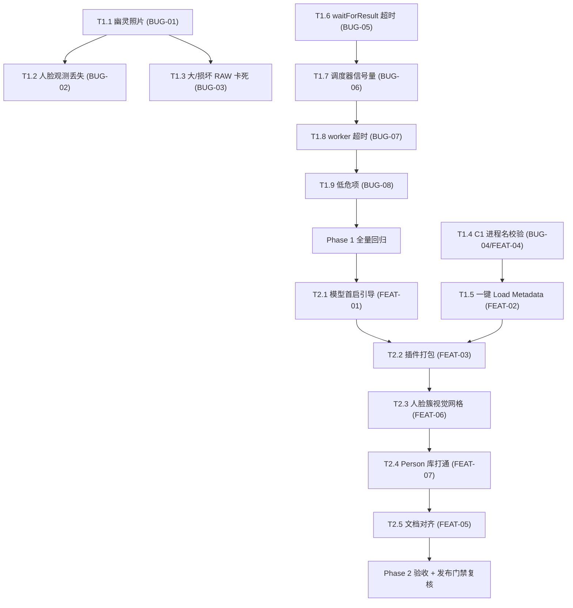

# Gather 可靠性 Bug 与功能补全 — 设计与执行

> 状态：设计待评审 / 计划待评审
> 文档版本：v1.0（设计与执行合并版）
> 日期：2026-08-04
> 代码基线：`main` @ `55d2739`
> 来源：架构 / 代码 / 用户 / 测试四视角 Review（2026-08-04）
> 原则：先修会咬用户的可靠性 Bug，再补挡住采用的完成度断档；所有改动遵守
> docs/DEVELOPMENT.md 既定约定（平台逻辑只在组合根、React Query 持有服务端状态、
> 推送优先、迁移不变量）。每阶段保持应用可启动、旧库可读、现有工作流可用。
---

## 1. 文档目的

把四视角 Review 结论转化为可实施、可验收的工程计划，覆盖：

- **Phase 1 — 可靠性 Bug 修复**（BUG-01 ~ BUG-08）：数据不丢、不误显示、
  不卡死、不挂起；
- **Phase 2 — 功能补全**（FEAT-01 ~ FEAT-07）：让"Send to Gather → 挑片 →
  写回 → Load Metadata"首套流程零配置跑通，并消除文档与产品的落差。

每项任务同时给出：现象与根因（设计依据）、修复/实现设计、涉及文件、
关键改动、测试与验收条件。

---

## 2. 执行顺序总览

关键路径：BUG-01/02/03 相互独立可并行；FEAT-02 依赖 FEAT-04；Phase 2 的
FEAT-01/03/06 相互独立。

---

## 3. Phase 1 — 可靠性 Bug 修复

### T1.1 / BUG-01 幽灵照片：增量扫描不标记已删除文件

**现象**：磁盘删除文件后，图库/画廊仍显示该照片（甚至能加载出旧缩略图），
直到全量重扫或应用重启。

**根因**（`desktop/src/main/services/indexer/index.service.ts`）：
`scanBatch` 内对每个文件的第一步是 `discoveredSet.add(normalized)`（`:312`），
发生在 `stat()` **之前**。当文件在扫描与 `stat()` 之间被删除（或 watcher
的 delete 事件把路径喂进增量扫描）时，`stat()` 抛错，`catch` 返回
`{ kind: 'failed' }`（`:342-343`），但该路径已写入 `discoveredSet`。
末尾的 missing 判定 `!discoveredSet.has(normalized)`（`:542-546`）因此
永远不认为它缺失 → `markMissing` 与 asset 置 `offline` 均被跳过。

**修复设计**（三处小改）：

1. 每文件的异步处理改为"先 `stat()` 判存在，后计数"：
   - `stat()` 抛错 → 返回 `{ kind: 'missing' }`，**不**加入 `discoveredSet`；
   - `stat()` 成功 → 立刻 `discoveredSet.add(normalized)`，再执行
     维度/校验和；后续失败仍返回 `{ kind: 'failed' }`（文件存在但处理失败，
     不应误判为缺失）。
2. 保留现有 missing 判定逻辑不变（`!discoveredSet.has`），此时语义正确。
3. 返回结果中 `failed` 与 `missing` 分开计数，UI 提示可区分"无法读取"与
   "文件已移除"。

**权衡**：方案 A（移动 `discoveredSet.add` 到 stat 后）改动最小且语义正确，
优于方案 B（额外维护"目录列出的路径集合"）——避免引入第二份集合。

**关键改动文件**：`desktop/src/main/services/indexer/index.service.ts`

**测试**：`tests/unit/services/indexer/index-incremental-scan.test.ts`
（新建）：建文件→扫描→删文件→重扫→断言 `missing=1`、photo
`status='missing'`、asset `online_status='offline'`。

**验收**：单测通过；e2e 回归无回归。

---

### T1.2 / BUG-02 人脸分析失败时静默丢失已有人脸观测

**现象**：对同一 session 重新运行人脸分析时，若模型/设置变化导致某张照片
推理失败，该照片先前有效的人脸观测被删除，簇成员数静默塌缩，已绑定角色
的簇内容丢失。

**根因**（`desktop/src/main/services/face-kw/face-kw.service.ts`）：
循环体内对每张需要重分析的**照片先无条件执行**
`deleteObservationsByPhoto`（`:248`），随后才 `getPreview` + 推理。若推理抛错，
`catch`（`:290-293`）仅递增 `detectionFailures` 并继续，旧观测已不可恢复。
（工程注释 `:212-214` 已对"簇/绑定不先删"做了保护，但逐照片观测漏掉了。）

**修复设计**：

1. 将 `deleteObservationsByPhoto` 移到**推理成功之后、写入新观测之前**。
2. 删除旧观测与新观测写入放入同一个 `better-sqlite3` 事务，保证原子性。
3. 失败路径（推理抛错）不触碰旧观测；`detectionFailures` 计数逻辑不变。
4. `upsertAnalysisState` 保持仅在成功后写入。

**权衡**：方案 A（成功后才删旧）在事务内删除，外部不可见；优于方案 B
（先删旧、失败回滚）——需要快照/恢复机制，复杂度高。

**关键改动文件**：`desktop/src/main/services/face-kw/face-kw.service.ts`

**测试**：`tests/unit/services/face-kw/face-kw-observations.test.ts`
（新建）：mock repo/service——推理抛错断言旧观测保留、状态未更新；成功
断言旧观测被替换。

**验收**：单测通过；有素材 e2e（face-workflow）不回归。

---

### T1.3 / BUG-03 大文件/损坏 RAW 使主进程卡死

**现象**：exiftool 无法解析的 RAW（损坏或罕见容器）会整文件读入主进程堆
（数百 MB），并触发二次方复杂度的 JPEG 段扫描，缩略图/预览生成卡住、内存尖峰。

**根因**（`desktop/src/main/services/image/decoders/sharp-decoder.ts`）：
- 兼容回退路径 `fsp.readFile(filepath)` 全量读入（`:147`）；
- `findJpegSegments`（`:281-300`）内层循环在未找到 EOI 的失败段上只
  `i++` 继续扫描，最坏 O(n²)；
- 无内存/时间上限，且失败前不中断。

**修复设计**：

1. **段扫描改单遍状态机**：一次线性扫描标记 FFD8 / FFD9 区间，跳过已消费
   区域，复杂度 O(n)。
2. **大文件不整读**：对 `stat.size` 超过阈值（建议 192 MB）的 RAW，先经
   exiftool 定位内嵌 JPEG 的 offset/size，再用 `readFileRange` 只读该区间；
   无法定位则直接回退 `sips` 渲染（macOS），不再整读。
3. **上限保护**：为整读路径增加大小上限（超过即回退），为段扫描增加
   扫描字节上限与超时；超限视为不可解码，返回 `null` 触发回退链，
   绝不阻塞主进程。
4. 与现有 `rawIndex` 负缓存结合：失败结果同样持久化，避免每次请求重试。

**关键改动文件**：`desktop/src/main/services/image/decoders/sharp-decoder.ts`
（+ `findJpegSegments` 相关 helper）

**测试**：`tests/unit/services/image/sharp-decoder-raw.test.ts`（新建）：
合成"大头部 + 内嵌 JPEG"RAW 断言提取成功；损坏/超大 RAW 断言快速失败
（< 数秒）且不整读、不挂起。

**验收**：单测通过；`image-service` / `sharp-decoder` 既有测试不回归。

---

### T1.4 / BUG-04 + FEAT-04 Capture One 进程名校验过严

**现象**：真实安装名为 "Capture One Pro"（或本地化后缀）时，
`getCaptureOneAppName` 抛 `Potentially unsafe process name rejected`，
导致"从 C1 导入"与"重载元数据"直接失败。

**根因**（`desktop/src/main/capture-one.ts:46`）：
`/^Capture One( \d+)?$/` 只允许精确匹配，注释 `:44-45` 亦自述该风险。

**修复设计**：

1. 把进程名校验抽取为纯函数 `sanitizeCaptureOneAppName(name)`：
   - 允许 `Capture One` 前缀 + 任意**安全字符**后缀（白名单
     `[A-Za-z0-9 ._+()-]`，不区分大小写处理 "capture one"）；
   - 拒绝一切含引号、反斜杠、分号、换行、`\u0000` 等可能注入 osascript
     的字符；
   - 空串/非匹配返回 `null`（视为"未找到 C1"）。
2. 使用处仅接受 sanitize 后的名字拼入 `tell application "..."`；
   其余流程（未找到 → 友好报错 `:56`）不变。
3. 保留失败时的明确错误信息，不静默。

**关键改动文件**：`desktop/src/main/capture-one.ts`

**测试**：`tests/unit/services/capture-one-name.test.ts`（新建）：
"Capture One"、"Capture One Pro"、"Capture One 16.4" 通过；含引号/分号、
换行等拒绝；`Photoshop` 返回 `null`。

**验收**：单测通过；`c1:get-selected-photos` 相关 e2e 不回归。功能侧效果：
"从 C1 导入"与"一键 Load Metadata"在真实命名下可用。

---

### T1.5 / FEAT-02 写回后一键 "Load Metadata" 到 Capture One

**现状**：`reloadMetadata` 已实现并暴露在 preload（`preload/index.ts:173`、
`index.ts:340-343`），但渲染层**零调用**；用户写回后必须手动切到 C1 执行
Image → Load Metadata。

**设计**：

1. 在三个写回面加入"在 Capture One 中加载元数据"按钮：
   - Culling 同步状态栏（`Culling.tsx` 状态区域）；
   - Similarity 写回报告区（`Similarity/index.tsx`）；
   - FaceKW StepWriteback 结果卡片（`StepWriteback.tsx`）。
2. 按钮调用 `window.gather.reloadMetadata()`；失败（C1 未运行/无文档）时
   toast 提示具体原因。
3. 与"确认同步"流程衔接：按钮文案/步骤提示明确"先在 C1 Load Metadata，
   再返回 Gather 确认同步"（与 README 现有描述一致）。

**关键改动文件**：`desktop/src/renderer/pages/SessionDetail/Culling.tsx`、
`desktop/src/renderer/pages/Similarity/index.tsx`、
`desktop/src/renderer/pages/FaceKeywording/StepWriteback.tsx`

**测试**：e2e 断言按钮存在且可点击（不真连 C1）；`c1:reload-metadata`
handler 单测；真实 C1 行为保留为人工验证项（TEST.md）。

**验收**：e2e 通过；人工项记录到 TEST.md（真实 C1 Load Metadata 矩阵）。

---

### T1.6 / BUG-05 `jobs.waitForResult` 可永久挂起

**现象**：`sim.analyze` / `fkw.analyze` 等在 IPC handler 内
`await jobs.waitForResult(id)`（`similarity.ipc.ts:125`、
`face-kw.ipc.ts:58`）。若任务因无注册 executor、排队后从未被 drain 认领
等原因永远不结束，waiter 永不 settle，UI 请求永久 pending。

**根因**（`desktop/src/main/services/jobs/job.service.ts:126-149`）：
waiter 只由 `completeResult` 触发；没有超时、没有"任务从未开始"的兜底。

**修复设计**：

1. `waitForResult(jobId, options?: { timeoutMs })` 增加可配超时（默认
   10 分钟，沿用现有 settings 风格），超时后 reject 并给出可读错误
   （含 jobId/status），同时清理该 waiter，避免内存泄漏。
2. 创建任务时（`jobs.create`）校验 `type` 存在已注册 executor，不存在则
   立即失败——从源头杜绝"永远等不到"。
3. 队列侧兜底：drain 对超过 `stale_after_ms` 仍 `queued` 且无认领者的任务
   标记 `failed`（`stale_after` 已在 repo 层存在，复用其心跳语义）。

**关键改动文件**：`desktop/src/main/services/jobs/job.service.ts`

**测试**：`tests/unit/services/jobs/job-wait-for-result.test.ts`（新建）：
注册永不结束的 executor 断言按超时 reject；`create` 未注册 type 立即抛错。

**验收**：单测通过；既有 jobs 测试（cancel/retry/resume）不回归。

---

### T1.7 / BUG-06 任务调度器并发上限竞态

**现象**：`HeavyTaskScheduler`（`utils/heavy-task-scheduler.ts:20-40`）与
`DecodeLimiter`（`image.service.ts:178-200`）在"释放槽位"与"新任务入场"
间存在微任务竞态，瞬时并发可超过上限，CPU 突刺。

**根因**：`finally { active--; pending.shift()?.start() }` 中，被唤醒等待者
的后续 `active++` 在**下一个微任务**执行；同一 tick 的新 `run()` 看到
`active < limit` 直接进场，导致瞬时超限。

**修复设计**：

1. 抽取一个通用有界信号量工具（如 `utils/bounded-semaphore.ts`）：
   `acquire()` 在 `active >= limit` 时入队并 await；`release()` 依次唤醒
   队首，被唤醒者在**恢复执行时**才 `active++`，保证计数与排队在同一
   同步段内完成，消除"先检查后进位"的窗口。
2. `HeavyTaskScheduler.run` 与 `DecodeLimiter.run` 改为复用同一实现
   （保持各自的 limit 来源与优先级排序）。
3. 保持现有对外 API 与优先级排序语义不变。

**关键改动文件**：`desktop/src/main/utils/bounded-semaphore.ts`（新建）、
`desktop/src/main/utils/heavy-task-scheduler.ts`、
`desktop/src/main/services/image/image.service.ts`

**测试**：`tests/unit/services/image/decode-limiter.test.ts`（新建）：
并发提交 2×limit 个任务，注入同步计数器断言任一时刻 `active ≤ limit`。

**验收**：单测通过；`image-service` 既有测试不回归。

---

### T1.8 / BUG-07 聚类 worker 挂起 / 线程泄漏

**现象**：`analysis-worker-client.ts:9-38` 的 `runWorker` 无超时；若 worker
死循环或永不回消息，线程不回收，pending promise 与 IPC 调用方永不 resolve。

**根因**：只监听 `message` / `error` / `abort`，无 hang 兜底。

**修复设计**：

1. 为单次 worker 运行增加 `timeoutMs`（默认 60s，可配）：超时后
   `terminate()` + reject（错误信息含任务类型）。
2. `signal` abort 与超时竞态收敛：用一个 `settled` 标志保证 resolve/reject
   只发生一次，且无论如何 `terminate()`。
3. 增加 worker `exit` 监听兜底：未 settle 时以"worker 意外退出"拒绝。

**关键改动文件**：`desktop/src/main/utils/analysis-worker-client.ts`

**测试**：`tests/unit/services/similarity/analysis-worker-timeout.test.ts`
（新建，打桩永不响应的 worker）：断言按时 reject 且 `terminate` 被调用。

**验收**：单测通过；similarity/face 聚类既有测试不回归。

---

### T1.9 / BUG-08 其他低危项

| 编号 | 位置 | 问题 | 设计 |
|------|------|------|------|
| 8a | `image.service.ts:163-170` | 缓存键用 `mtimeMs` 取整 + size，同一毫秒重写同大小文件返回旧缩略图 | 键中加入 `ino`（或改用整数 `mtimeNs`/ctime） |
| 8b | `metadata-mutation.service.ts:74-102` | per-path promise 链：任一 mutation 拒绝会把错误抛给下一个调用者 | 链内 `catch` 吞掉并记录，仅向当前调用者返回自身结果；保持 `finally` 清理 |
| 8c | `export.service.ts:298` | `startsWith(destination + sep)` 在 macOS 大小写不敏感文件系统上误判 | 比较前对两侧 `fs.realpath`（或统一 `toLowerCase`）归一化 |
| 8d | `main/index.ts:373-408` | `app:scan-directory` 无界递归、无缓存目录排除、无上限 | 复用 `IndexService.walk`，增加深度/数量上限与排除规则 |
| 8e | `culling.service.ts:798` | `Number(groupId.split(':').at(-1))` 对畸形 id 得 `NaN` | 解析前校验格式，非法则返回错误而非参与 `sort` |

**关键改动文件**：上述各模块；**测试**：各模块对应单测补充（8e 加畸形
groupId 用例；8a 加同 ms 重写用例）。**验收**：单测通过。

---

## 4. Phase 2 — 功能补全

### T2.1 / FEAT-01 人脸模型首次运行引导

**现状**：模型缺失时 `fkw.analyze` 直接失败（`face-kw.ipc.ts:48-49` 取
settings 默认路径，`resolveModelPath` 找不到即抛错），`StepAnalyze.tsx`
只显示错误文本，无任何指引；模型下载 UI 深藏在 `Settings/index.tsx:306-327`。

**设计**：

1. 新增 `face.models_status` 命令：返回
   `{ detectorPresent, encoderPresent, detectorPath, encoderPath, versions }`
   （版本指纹复用 `face-kw.service.ts` 已有的 `modelFingerprint`）。
2. `StepAnalyze.tsx` 挂载时查询状态；缺失时在面板顶部显示内联引导卡片：
   "人脸模型未安装 → 打开设置自动下载（约 182 MB）"。
3. "去设置"按钮跳转 Settings 模型面板；面板复用现有
   `models.download_default` 命令 + `models:download-progress` 事件显示进度。
4. `fkw.analyze` 失败时若根因是模型缺失，把错误文案与引导一并返回。

**关键改动文件**：`desktop/src/main/ipc/face-kw.ipc.ts`（新增 `face.models_status`）、
`desktop/src/renderer/pages/FaceKeywording/StepAnalyze.tsx`、
`desktop/src/renderer/pages/Settings/index.tsx`

**测试**：`face.models_status` handler 单测；无模型场景 e2e 断言引导卡片
出现、跳转可用；模型存在时不显示。

**验收**：e2e/单测通过；手工核验下载进度条。

---

### T2.2 / FEAT-03 Capture One 插件随发布打包

**现状**：`GatherLink.coplugin` 需手动 `make all && make install`
（`desktop/coplugin/Makefile`），发布包未附带，"Send to Gather"对普通用户
不可用。

**设计**：

1. electron-builder 增加 `afterPack` 钩子（或打包脚本）：当宿主机存在
   Capture One SDK（`Capture_One_Plugin_SDK_*/`）时编译插件并放进
   `extraResources` 的 `plugins/`；SDK 缺失时**跳过并打印警告**（不阻断
   主包发布）。
2. 在 README/发布说明提供一键安装：将 `plugins/GatherLink.coplugin`
   复制到 `~/Library/Application Support/Capture One/Plug-ins/` 并重启 C1。
3. 插件签名/公证不在本期范围（记录为已知限制）。

**关键改动文件**：`desktop/electron-builder.yml`（afterPack 钩子）、
`desktop/scripts/build-coplugin.mjs`（新建，mac 专用）

**测试**：本机 `npm run build` + 检查产物 bundle 结构正确；无 SDK 环境验证
打包不失败。

**验收**：产物含插件 bundle；无 SDK 不阻断发布。

---

### T2.3 / FEAT-06 人脸簇审核视觉网格

**现状**：`StepReview.tsx` 卡片缩略图在点击后才加载（`:129-131`），网格初始
为数字占位，无法快速"扫脸找人"，拖慢核心审核流程。

**设计**：

1. 进入 review 步骤时，对当前筛选范围内的簇批量预取成员人脸缩略图
   （复用 `imageApi.thumbnailUrl` 与现有 thumbnail 管线，大小沿用
   `thumbnail_size` 设置）。
2. 卡片渲染为真实缩略图网格（沿用 Gallery 的懒加载 + 占位模式），保留
   "点击进详情"交互与 All/Unbound/Bound/Skipped 筛选。
3. 预取数量受控（如每簇首张 + 前 K 张成员），避免一次性拉全量。

**关键改动文件**：`desktop/src/renderer/pages/FaceKeywording/StepReview.tsx`、
`desktop/src/renderer/api/faceKw.ts`（预取接口）

**测试**：有素材 e2e 断言网格缩略图自然加载；无素材时 UI 正常渲染占位不报错。

**验收**：e2e 通过。

---

### T2.4 / FEAT-07 Person 库与角色绑定打通

**现状**：`person.*` 命令存在但无 UI；角色绑定（`fkw.bind`）不写 Person 表，
Person 库与"人脸库"脱节（`Persons/index.tsx` 无数据来源）。

**设计**（本期范围：只读打通 + 自动创建，交互扩展放 P2）：

1. `fkw.bind` 成功后自动 upsert person（角色名归一化为 person 名），并建立
   person ↔ 绑定的簇/照片关联。
2. `Persons/index.tsx` 展示已绑定角色聚合：名称、照片数、人脸数，点击可
   跳转到对应 session 的 FaceKW 审核（按角色筛选）。
3. `person.merge` 的 UI 入口与"从簇自动建 Person"的完整策略列为 P2。

**关键改动文件**：`desktop/src/main/ipc/person.ipc.ts`、`person.repo.ts`、
`desktop/src/renderer/pages/Persons/index.tsx`

**测试**：`person.repo` 单测（upsert/关联）；有素材 e2e 断言绑定后 Persons
页出现对应条目。

**验收**：单测 + e2e 通过。

---

### T2.5 / FEAT-05 文档与产品对齐（消除承诺落差）

**现状**：README.md / README_CN.md / TEST.md 承诺 5 步人脸向导（①Import
②Clusters ③Bind ④Preview ⑤Writeback）、相似度写回 `createAlbums / addPrefix /
markUngrouped / writeIPTC`、Dashboard "Import from Capture One" 按钮；
实际 UI 是 3 步（分析→审核→写回，`FaceKeywording/index.tsx:24-28`）、相似度
仅关键词写回（`writeback-planners.ts` 只支持 keywords）、导入入口在对话框内。

**设计**（本期先做文档对齐，恢复功能列为 P2 候选）：

1. 修订 README / README_CN / TEST.md：
   - 人脸标注描述改为"分析 → 审核（绑定/合并/跳过）→ 写回 + 确认同步"三步；
   - 相似度写回明确当前支持"关键词（dc:subject）"；其余选项标注为路线图；
   - Dashboard 导入入口如实描述。
2. 在 `docs/ROADMAP.md` 或本计划中记录待恢复项：相似度多写回选项、
   5 步向导恢复，避免彻底丢失产品意图。

**关键改动文件**：`README.md`、`docs/README_CN.md`、`docs/TEST.md`

**测试**：无（纯文档）；**验收**：人工对照 UI 核验一致性。

---

## 5. 非目标（本期明确不做）

- AssetService 抽取、repo 去"上帝对象"化（P2 架构项）；
- 合并遗留 `progress` / `jobs:progress` 双进度通道；
- 恢复相似度多写回选项（createAlbums 等）与 5 步人脸向导（记录为 P2 候选）；
- 架构债务重构后再次重写 `docs/DEVELOPMENT.md` 的架构章节、拆 `index.ts`；
- 插件签名 / 公证；Windows NSIS 打包验证；
- 真实 Capture One 的人工 Load-Metadata 矩阵（保留为发布门禁，ADR #2）。

---

## 6. 设计原则与约束

1. **遵守既定约定**：平台逻辑（sips、swiftc 插件）只在组合根/构建脚本；
   服务端状态走 React Query；事件用 `useEvent`；数据库迁移不变量与
   schema 快照（ADR-005/006）不得破坏。
2. **不扩大攻击面**：所有新增 IPC 命令进 `preload/index.ts` 白名单 +
   `packages/shared` 协议类型 + `protocol.test.ts` 契约测试。
3. **失败即安全**：写元数据、删观测、改状态前先做基线/备份或事务，失败
   不破坏已有用户数据。
4. **本次不改架构债务**：AssetService 抽取、双进度通道合并、`docs/DEVELOPMENT.md`
   架构章节重写等列为 P2 架构项，不在本计划内。

---

## 7. 风险与依赖

- BUG-03 的 RAW 处理涉及解码链，改动需在 mac 与 CI 双平台回归（sips 仅
  darwin，现有 `f384bce` 起已按平台跳过相关单测）。
- FEAT-02 / FEAT-04 依赖真实 Capture One 做最终验收；自动化只覆盖命令层与
  UI 存在性，Load Metadata 的人工矩阵仍保留（ADR 发布门禁 #2）。
- FEAT-03 依赖本机是否有 C1 SDK；打包脚本必须支持无 SDK 降级，否则阻断发布。
- BUG-02 事务化改写人脸观测，需与现有 `analysisSignature` 复用逻辑配合，
  避免重复分析时把"复用缓存"与"删除旧观测"的顺序搞错。

---

## 8. 验收清单（汇总）

- [ ] BUG-01~08 各自单测 + 回归全绿
- [ ] FEAT-01/02/03/04/06/07 的自动化与手工项完成
- [ ] FEAT-05 文档与 UI 一致
- [ ] 发布门禁复核：ADR 发布门禁 #2 人工矩阵项已安排
- [ ] 工作区无未提交密钥/生成物
